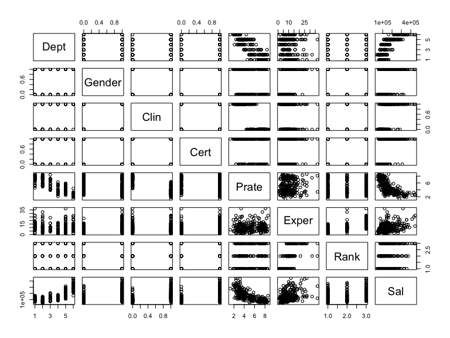
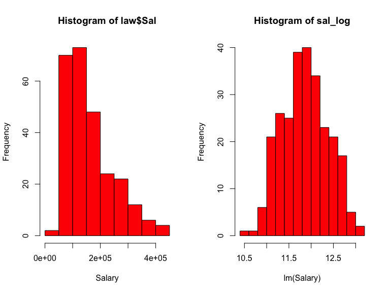
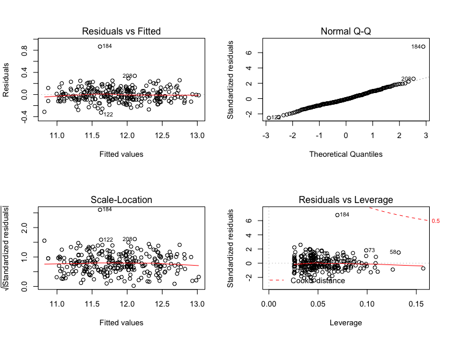
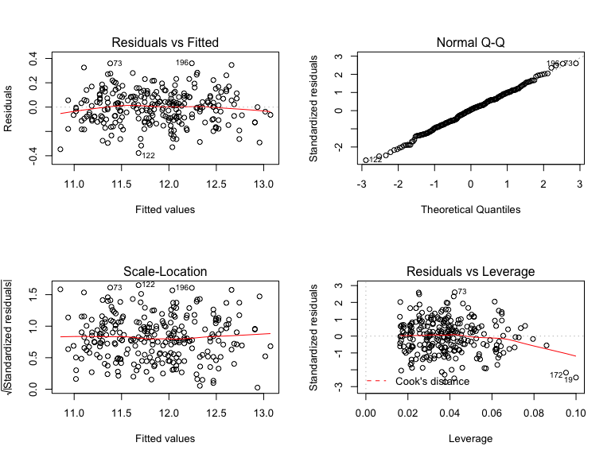

Final Project
================

# Data exploration

``` r
law = read_csv("./data/Lawsuit.csv") %>%
  mutate(Sal = (Sal94 + Sal95)/2) %>%
  dplyr::select(-ID, -Sal94, -Sal95)
```

    ## Parsed with column specification:
    ## cols(
    ##   ID = col_double(),
    ##   Dept = col_double(),
    ##   Gender = col_double(),
    ##   Clin = col_double(),
    ##   Cert = col_double(),
    ##   Prate = col_double(),
    ##   Exper = col_double(),
    ##   Rank = col_double(),
    ##   Sal94 = col_double(),
    ##   Sal95 = col_double()
    ## )

``` r
law_df = law %>%
  mutate(Gender = factor(Gender, levels = c(0,1), labels = c("Female", "Male")),
         Dept = factor(Dept, levels = c(6,1,2,3,4,5), 
                       labels = c("Surgery", "Biochemistry/Molecular Biology", "Physiology", "Genetics", "Pediatrics", "Medicine")),
         Clin = factor(Clin, levels = c(0,1), labels = c("Primarily research emphasis", "Primarily clinical emphasis")),
         Cert = factor(Cert, levels = c(0,1), labels = c("not certified", "Board certified")),
         Rank = factor(Rank, levels = c(3,1,2), labels = c("Full professor", "Assistant", "Associate")))

my_labels <- list(Dept = "Department", Gender = "Gender", Clin = "Research/Clinical emphasis", Cert = "Not/Board Certificated", Prate = "Publication rate", Exper = "Experience(years)", Rank = "Title", Sal = "Average Salary in 1994-1995")

my_controls <- tableby.control(
  total = T,
  test = F, 
  digits = 2,
  numeric.stats = c("meansd", "medianq1q3", "range"),
  cat.stats = c("countpct"),
  stats.labels = list(
    meansd = "Mean (SD)",
    medianq1q3 = "Median (Q1, Q3)",
    range = "Min - Max",
    countpct = "N (%)"))

tab1 = tableby(Gender ~ Dept + Clin + Cert + Prate + Exper + Rank + Sal, data = law_df, control = my_controls) %>%
  summary(title = "Summary by Gender", 
        labelTranslations = my_labels, text = T)

tab1 %>% knitr::kable(format = "html")
```

<table>

<thead>

<tr>

<th style="text-align:left;">

</th>

<th style="text-align:left;">

Female (N=106)

</th>

<th style="text-align:left;">

Male (N=155)

</th>

<th style="text-align:left;">

Total (N=261)

</th>

</tr>

</thead>

<tbody>

<tr>

<td style="text-align:left;">

Department

</td>

<td style="text-align:left;">

</td>

<td style="text-align:left;">

</td>

<td style="text-align:left;">

</td>

</tr>

<tr>

<td style="text-align:left;">

  - Surgery
    </td>
    <td style="text-align:left;">
    5 (4.7%)
    </td>
    <td style="text-align:left;">
    35 (22.6%)
    </td>
    <td style="text-align:left;">
    40 (15.3%)
    </td>
    </tr>
    <tr>
    <td style="text-align:left;">
      - Biochemistry/Molecular Biology
        </td>
        <td style="text-align:left;">
        20 (18.9%)
        </td>
        <td style="text-align:left;">
        30 (19.4%)
        </td>
        <td style="text-align:left;">
        50 (19.2%)
        </td>
        </tr>
        <tr>
        <td style="text-align:left;">
          - Physiology
            </td>
            <td style="text-align:left;">
            20 (18.9%)
            </td>
            <td style="text-align:left;">
            20 (12.9%)
            </td>
            <td style="text-align:left;">
            40 (15.3%)
            </td>
            </tr>
            <tr>
            <td style="text-align:left;">
              - Genetics
                </td>
                <td style="text-align:left;">
                11 (10.4%)
                </td>
                <td style="text-align:left;">
                10 (6.5%)
                </td>
                <td style="text-align:left;">
                21 (8.0%)
                </td>
                </tr>
                <tr>
                <td style="text-align:left;">
                  - Pediatrics
                    </td>
                    <td style="text-align:left;">
                    20 (18.9%)
                    </td>
                    <td style="text-align:left;">
                    10 (6.5%)
                    </td>
                    <td style="text-align:left;">
                    30 (11.5%)
                    </td>
                    </tr>
                    <tr>
                    <td style="text-align:left;">
                      - Medicine
                        </td>
                        <td style="text-align:left;">
                        30 (28.3%)
                        </td>
                        <td style="text-align:left;">
                        50 (32.3%)
                        </td>
                        <td style="text-align:left;">
                        80 (30.7%)
                        </td>
                        </tr>
                        <tr>
                        <td style="text-align:left;">
                        Research/Clinical emphasis
                        </td>
                        <td style="text-align:left;">
                        </td>
                        <td style="text-align:left;">
                        </td>
                        <td style="text-align:left;">
                        </td>
                        </tr>
                        <tr>
                        <td style="text-align:left;">
                          - Primarily research emphasis
                            </td>
                            <td style="text-align:left;">
                            46 (43.4%)
                            </td>
                            <td style="text-align:left;">
                            55 (35.5%)
                            </td>
                            <td style="text-align:left;">
                            101 (38.7%)
                            </td>
                            </tr>
                            <tr>
                            <td style="text-align:left;">
                              - Primarily clinical emphasis
                                </td>
                                <td style="text-align:left;">
                                60 (56.6%)
                                </td>
                                <td style="text-align:left;">
                                100 (64.5%)
                                </td>
                                <td style="text-align:left;">
                                160 (61.3%)
                                </td>
                                </tr>
                                <tr>
                                <td style="text-align:left;">
                                Not/Board Certificated
                                </td>
                                <td style="text-align:left;">
                                </td>
                                <td style="text-align:left;">
                                </td>
                                <td style="text-align:left;">
                                </td>
                                </tr>
                                <tr>
                                <td style="text-align:left;">
                                  - not certified
                                    </td>
                                    <td style="text-align:left;">
                                    36 (34.0%)
                                    </td>
                                    <td style="text-align:left;">
                                    37 (23.9%)
                                    </td>
                                    <td style="text-align:left;">
                                    73 (28.0%)
                                    </td>
                                    </tr>
                                    <tr>
                                    <td style="text-align:left;">
                                      - Board certified
                                        </td>
                                        <td style="text-align:left;">
                                        70 (66.0%)
                                        </td>
                                        <td style="text-align:left;">
                                        118 (76.1%)
                                        </td>
                                        <td style="text-align:left;">
                                        188 (72.0%)
                                        </td>
                                        </tr>
                                        <tr>
                                        <td style="text-align:left;">
                                        Publication rate
                                        </td>
                                        <td style="text-align:left;">
                                        </td>
                                        <td style="text-align:left;">
                                        </td>
                                        <td style="text-align:left;">
                                        </td>
                                        </tr>
                                        <tr>
                                        <td style="text-align:left;">
                                          - Mean
                                            (SD)
                                            </td>
                                            <td style="text-align:left;">
                                            5.35
                                            (1.89)
                                            </td>
                                            <td style="text-align:left;">
                                            4.65
                                            (1.94)
                                            </td>
                                            <td style="text-align:left;">
                                            4.93
                                            (1.94)
                                            </td>
                                            </tr>
                                            <tr>
                                            <td style="text-align:left;">
                                              - Median (Q1,
                                                Q3)
                                                </td>
                                                <td style="text-align:left;">
                                                5.25 (3.73,
                                                7.27)
                                                </td>
                                                <td style="text-align:left;">
                                                4.00 (3.10,
                                                6.70)
                                                </td>
                                                <td style="text-align:left;">
                                                4.40 (3.20,
                                                6.90)
                                                </td>
                                                </tr>
                                                <tr>
                                                <td style="text-align:left;">
                                                  - Min -
                                                    Max
                                                    </td>
                                                    <td style="text-align:left;">
                                                    2.40 -
                                                    8.70
                                                    </td>
                                                    <td style="text-align:left;">
                                                    1.30 -
                                                    8.60
                                                    </td>
                                                    <td style="text-align:left;">
                                                    1.30 -
                                                    8.70
                                                    </td>
                                                    </tr>
                                                    <tr>
                                                    <td style="text-align:left;">
                                                    Experience(years)
                                                    </td>
                                                    <td style="text-align:left;">
                                                    </td>
                                                    <td style="text-align:left;">
                                                    </td>
                                                    <td style="text-align:left;">
                                                    </td>
                                                    </tr>
                                                    <tr>
                                                    <td style="text-align:left;">
                                                      - Mean
                                                        (SD)
                                                        </td>
                                                        <td style="text-align:left;">
                                                        7.49
                                                        (4.17)
                                                        </td>
                                                        <td style="text-align:left;">
                                                        12.10
                                                        (6.70)
                                                        </td>
                                                        <td style="text-align:left;">
                                                        10.23
                                                        (6.23)
                                                        </td>
                                                        </tr>
                                                        <tr>
                                                        <td style="text-align:left;">
                                                          - Median (Q1,
                                                            Q3)
                                                            </td>
                                                            <td style="text-align:left;">
                                                            7.00 (5.00,
                                                            10.00)
                                                            </td>
                                                            <td style="text-align:left;">
                                                            10.00 (7.00,
                                                            15.00)
                                                            </td>
                                                            <td style="text-align:left;">
                                                            9.00 (6.00,
                                                            14.00)
                                                            </td>
                                                            </tr>
                                                            <tr>
                                                            <td style="text-align:left;">
                                                              - Min -
                                                                Max
                                                                </td>
                                                                <td style="text-align:left;">
                                                                1.00 -
                                                                23.00
                                                                </td>
                                                                <td style="text-align:left;">
                                                                2.00 -
                                                                37.00
                                                                </td>
                                                                <td style="text-align:left;">
                                                                1.00 -
                                                                37.00
                                                                </td>
                                                                </tr>
                                                                <tr>
                                                                <td style="text-align:left;">
                                                                Title
                                                                </td>
                                                                <td style="text-align:left;">
                                                                </td>
                                                                <td style="text-align:left;">
                                                                </td>
                                                                <td style="text-align:left;">
                                                                </td>
                                                                </tr>
                                                                <tr>
                                                                <td style="text-align:left;">
                                                                  - Full
                                                                    professor
                                                                    </td>
                                                                    <td style="text-align:left;">
                                                                    16
                                                                    (15.1%)
                                                                    </td>
                                                                    <td style="text-align:left;">
                                                                    69
                                                                    (44.5%)
                                                                    </td>
                                                                    <td style="text-align:left;">
                                                                    85
                                                                    (32.6%)
                                                                    </td>
                                                                    </tr>
                                                                    <tr>
                                                                    <td style="text-align:left;">
                                                                      - Assistant
                                                                        </td>
                                                                        <td style="text-align:left;">
                                                                        69
                                                                        (65.1%)
                                                                        </td>
                                                                        <td style="text-align:left;">
                                                                        43
                                                                        (27.7%)
                                                                        </td>
                                                                        <td style="text-align:left;">
                                                                        112
                                                                        (42.9%)
                                                                        </td>
                                                                        </tr>
                                                                        <tr>
                                                                        <td style="text-align:left;">
                                                                          - Associate
                                                                            </td>
                                                                            <td style="text-align:left;">
                                                                            21
                                                                            (19.8%)
                                                                            </td>
                                                                            <td style="text-align:left;">
                                                                            43
                                                                            (27.7%)
                                                                            </td>
                                                                            <td style="text-align:left;">
                                                                            64
                                                                            (24.5%)
                                                                            </td>
                                                                            </tr>
                                                                            <tr>
                                                                            <td style="text-align:left;">
                                                                            Average
                                                                            Salary
                                                                            in
                                                                            1994-1995
                                                                            </td>
                                                                            <td style="text-align:left;">
                                                                            </td>
                                                                            <td style="text-align:left;">
                                                                            </td>
                                                                            <td style="text-align:left;">
                                                                            </td>
                                                                            </tr>
                                                                            <tr>
                                                                            <td style="text-align:left;">
                                                                              - Mean
                                                                                (SD)
                                                                                </td>
                                                                                <td style="text-align:left;">
                                                                                124874.09
                                                                                (59089.62)
                                                                                </td>
                                                                                <td style="text-align:left;">
                                                                                186126.43
                                                                                (90397.11)
                                                                                </td>
                                                                                <td style="text-align:left;">
                                                                                161250.00
                                                                                (84608.33)
                                                                                </td>
                                                                                </tr>
                                                                                <tr>
                                                                                <td style="text-align:left;">
                                                                                  - Median
                                                                                    (Q1,
                                                                                    Q3)
                                                                                    </td>
                                                                                    <td style="text-align:left;">
                                                                                    113706.00
                                                                                    (79059.88,
                                                                                    148401.12)
                                                                                    </td>
                                                                                    <td style="text-align:left;">
                                                                                    162987.00
                                                                                    (114612.50,
                                                                                    244332.25)
                                                                                    </td>
                                                                                    <td style="text-align:left;">
                                                                                    141628.00
                                                                                    (95176.50,
                                                                                    210012.50)
                                                                                    </td>
                                                                                    </tr>
                                                                                    <tr>
                                                                                    <td style="text-align:left;">
                                                                                      - Min
                                                                                        -
                                                                                        Max
                                                                                        </td>
                                                                                        <td style="text-align:left;">
                                                                                        36594.50
                                                                                        -
                                                                                        323872.50
                                                                                        </td>
                                                                                        <td style="text-align:left;">
                                                                                        55752.50
                                                                                        -
                                                                                        445859.00
                                                                                        </td>
                                                                                        <td style="text-align:left;">
                                                                                        36594.50
                                                                                        -
                                                                                        445859.00
                                                                                        </td>
                                                                                        </tr>
                                                                                        </tbody>
                                                                                        </table>

# Transformation

``` r
attach(law)
pairs(law)
```



``` r
cor_mat = round(cor(law),2)

sal_log = log(law$Sal)

par(mfrow = c(1,2))

hist(law$Sal, xlab = "Salary", freq = T, col = 2)

hist(sal_log, xlab = "lm(Salary)", freq = T, col = 2)
```



# Model

``` r
law_df = read_csv("./data/Lawsuit.csv") %>% 
  janitor::clean_names() %>% 
  mutate(mean_sal = log((sal94 + sal95)/2)) %>%
  mutate(gender = factor(gender, levels = c(0,1), labels = c("Female", "Male")),
         dept = factor(dept, levels = c(6,1,2,3,4,5), 
                       labels = c("Surgery", "Biochemistry/Molecular Biology", "Physiology", "Genetics", "Pediatrics", "Medicine")),
         clin = factor(clin, levels = c(0,1), labels = c("Primarily research emphasis", "Primarily clinical emphasis")),
         cert = factor(cert, levels = c(0,1), labels = c("not certified", "Board certified")),
         rank = factor(rank, levels = c(3,1,2), labels = c("Full professor", "Assistant", "Associate")))
```

    ## Parsed with column specification:
    ## cols(
    ##   ID = col_double(),
    ##   Dept = col_double(),
    ##   Gender = col_double(),
    ##   Clin = col_double(),
    ##   Cert = col_double(),
    ##   Prate = col_double(),
    ##   Exper = col_double(),
    ##   Rank = col_double(),
    ##   Sal94 = col_double(),
    ##   Sal95 = col_double()
    ## )

## First, fit only gender in the model

``` r
model_0 = lm(mean_sal~gender, data = law_df)

summary(model_0)
```

    ## 
    ## Call:
    ## lm(formula = mean_sal ~ gender, data = law_df)
    ## 
    ## Residuals:
    ##     Min      1Q  Median      3Q     Max 
    ## -1.1255 -0.3659 -0.0078  0.3342  1.0549 
    ## 
    ## Coefficients:
    ##             Estimate Std. Error t value Pr(>|t|)    
    ## (Intercept) 11.63319    0.04595 253.162  < 2e-16 ***
    ## genderMale   0.38530    0.05963   6.462  5.1e-10 ***
    ## ---
    ## Signif. codes:  0 '***' 0.001 '**' 0.01 '*' 0.05 '.' 0.1 ' ' 1
    ## 
    ## Residual standard error: 0.4731 on 259 degrees of freedom
    ## Multiple R-squared:  0.1388, Adjusted R-squared:  0.1355 
    ## F-statistic: 41.75 on 1 and 259 DF,  p-value: 5.103e-10

As a single variable, gender is significant. Let’s check confounder and
interaction

## Next see if a variable is a confounder or interaction

``` r
model_dept1 = lm(mean_sal~gender + dept, data = law_df)

model_dept2 = lm(mean_sal~gender*dept, data = law_df)

summary(model_dept1)
```

    ## 
    ## Call:
    ## lm(formula = mean_sal ~ gender + dept, data = law_df)
    ## 
    ## Residuals:
    ##      Min       1Q   Median       3Q      Max 
    ## -0.70544 -0.19433 -0.02501  0.16341  0.60779 
    ## 
    ## Coefficients:
    ##                                    Estimate Std. Error t value Pr(>|t|)
    ## (Intercept)                        12.42172    0.04967 250.101  < 2e-16
    ## genderMale                          0.20521    0.03355   6.116 3.60e-09
    ## deptBiochemistry/Molecular Biology -1.07668    0.05453 -19.743  < 2e-16
    ## deptPhysiology                     -1.20862    0.05804 -20.825  < 2e-16
    ## deptGenetics                       -0.87576    0.06958 -12.587  < 2e-16
    ## deptPediatrics                     -0.77133    0.06384 -12.083  < 2e-16
    ## deptMedicine                       -0.42725    0.04978  -8.583 9.34e-16
    ##                                       
    ## (Intercept)                        ***
    ## genderMale                         ***
    ## deptBiochemistry/Molecular Biology ***
    ## deptPhysiology                     ***
    ## deptGenetics                       ***
    ## deptPediatrics                     ***
    ## deptMedicine                       ***
    ## ---
    ## Signif. codes:  0 '***' 0.001 '**' 0.01 '*' 0.05 '.' 0.1 ' ' 1
    ## 
    ## Residual standard error: 0.2534 on 254 degrees of freedom
    ## Multiple R-squared:  0.7578, Adjusted R-squared:  0.752 
    ## F-statistic: 132.4 on 6 and 254 DF,  p-value: < 2.2e-16

``` r
summary(model_dept2)
```

    ## 
    ## Call:
    ## lm(formula = mean_sal ~ gender * dept, data = law_df)
    ## 
    ## Residuals:
    ##      Min       1Q   Median       3Q      Max 
    ## -0.64982 -0.19117 -0.03961  0.16822  0.65953 
    ## 
    ## Coefficients:
    ##                                                Estimate Std. Error t value
    ## (Intercept)                                   12.485029   0.113111 110.379
    ## genderMale                                     0.132855   0.120921   1.099
    ## deptBiochemistry/Molecular Biology            -1.117268   0.126462  -8.835
    ## deptPhysiology                                -1.327558   0.126462 -10.498
    ## deptGenetics                                  -1.019679   0.136417  -7.475
    ## deptPediatrics                                -0.811344   0.126462  -6.416
    ## deptMedicine                                  -0.465154   0.122174  -3.807
    ## genderMale:deptBiochemistry/Molecular Biology  0.034484   0.141254   0.244
    ## genderMale:deptPhysiology                      0.183603   0.144979   1.266
    ## genderMale:deptGenetics                        0.241638   0.163812   1.475
    ## genderMale:deptPediatrics                      0.002459   0.155619   0.016
    ## genderMale:deptMedicine                        0.031698   0.134289   0.236
    ##                                               Pr(>|t|)    
    ## (Intercept)                                    < 2e-16 ***
    ## genderMale                                    0.272963    
    ## deptBiochemistry/Molecular Biology             < 2e-16 ***
    ## deptPhysiology                                 < 2e-16 ***
    ## deptGenetics                                  1.31e-12 ***
    ## deptPediatrics                                7.01e-10 ***
    ## deptMedicine                                  0.000177 ***
    ## genderMale:deptBiochemistry/Molecular Biology 0.807330    
    ## genderMale:deptPhysiology                     0.206548    
    ## genderMale:deptGenetics                       0.141451    
    ## genderMale:deptPediatrics                     0.987407    
    ## genderMale:deptMedicine                       0.813593    
    ## ---
    ## Signif. codes:  0 '***' 0.001 '**' 0.01 '*' 0.05 '.' 0.1 ' ' 1
    ## 
    ## Residual standard error: 0.2529 on 249 degrees of freedom
    ## Multiple R-squared:  0.7634, Adjusted R-squared:  0.7529 
    ## F-statistic: 73.03 on 11 and 249 DF,  p-value: < 2.2e-16

``` r
# department is a confounder, not a modifier, and should be included in the model
```

``` r
model_rank1 = lm(mean_sal~gender + rank, data = law_df)

model_rank2 = lm(mean_sal~gender*rank, data = law_df)

summary(model_rank1)
```

    ## 
    ## Call:
    ## lm(formula = mean_sal ~ gender + rank, data = law_df)
    ## 
    ## Residuals:
    ##      Min       1Q   Median       3Q      Max 
    ## -1.10798 -0.37872  0.01491  0.35397  1.03532 
    ## 
    ## Coefficients:
    ##               Estimate Std. Error t value Pr(>|t|)    
    ## (Intercept)   11.73880    0.07315 160.475  < 2e-16 ***
    ## genderMale     0.34948    0.06442   5.425 1.34e-07 ***
    ## rankAssistant -0.12317    0.07322  -1.682   0.0938 .  
    ## rankAssociate -0.12839    0.07856  -1.634   0.1034    
    ## ---
    ## Signif. codes:  0 '***' 0.001 '**' 0.01 '*' 0.05 '.' 0.1 ' ' 1
    ## 
    ## Residual standard error: 0.4716 on 257 degrees of freedom
    ## Multiple R-squared:  0.151,  Adjusted R-squared:  0.1411 
    ## F-statistic: 15.23 on 3 and 257 DF,  p-value: 3.747e-09

``` r
summary(model_rank2)
```

    ## 
    ## Call:
    ## lm(formula = mean_sal ~ gender * rank, data = law_df)
    ## 
    ## Residuals:
    ##      Min       1Q   Median       3Q      Max 
    ## -1.04274 -0.37104  0.01751  0.35145  0.96675 
    ## 
    ## Coefficients:
    ##                          Estimate Std. Error t value Pr(>|t|)    
    ## (Intercept)               11.9302     0.1167 102.271  < 2e-16 ***
    ## genderMale                 0.1138     0.1295   0.879  0.38045    
    ## rankAssistant             -0.3798     0.1295  -2.933  0.00366 ** 
    ## rankAssociate             -0.2512     0.1548  -1.622  0.10601    
    ## genderMale:rankAssistant   0.4057     0.1581   2.567  0.01084 *  
    ## genderMale:rankAssociate   0.1337     0.1794   0.745  0.45700    
    ## ---
    ## Signif. codes:  0 '***' 0.001 '**' 0.01 '*' 0.05 '.' 0.1 ' ' 1
    ## 
    ## Residual standard error: 0.4666 on 255 degrees of freedom
    ## Multiple R-squared:  0.1752, Adjusted R-squared:  0.1591 
    ## F-statistic: 10.84 on 5 and 255 DF,  p-value: 1.829e-09

``` r
# rank is not a confounder, but probabaly a modifier.
```

``` r
model_prate1 = lm(mean_sal~gender + prate, data = law_df)

model_prate2 = lm(mean_sal~gender*prate, data = law_df)

summary(model_prate1)
```

    ## 
    ## Call:
    ## lm(formula = mean_sal ~ gender + prate, data = law_df)
    ## 
    ## Residuals:
    ##     Min      1Q  Median      3Q     Max 
    ## -0.8027 -0.1953  0.0039  0.1925  0.7354 
    ## 
    ## Coefficients:
    ##              Estimate Std. Error t value Pr(>|t|)    
    ## (Intercept) 12.648300   0.060244 209.951  < 2e-16 ***
    ## genderMale   0.251814   0.038823   6.486 4.46e-10 ***
    ## prate       -0.189739   0.009824 -19.313  < 2e-16 ***
    ## ---
    ## Signif. codes:  0 '***' 0.001 '**' 0.01 '*' 0.05 '.' 0.1 ' ' 1
    ## 
    ## Residual standard error: 0.3031 on 258 degrees of freedom
    ## Multiple R-squared:  0.6479, Adjusted R-squared:  0.6452 
    ## F-statistic: 237.4 on 2 and 258 DF,  p-value: < 2.2e-16

``` r
summary(model_prate2)
```

    ## 
    ## Call:
    ## lm(formula = mean_sal ~ gender * prate, data = law_df)
    ## 
    ## Residuals:
    ##      Min       1Q   Median       3Q      Max 
    ## -0.80151 -0.19424  0.00474  0.19135  0.77096 
    ## 
    ## Coefficients:
    ##                  Estimate Std. Error t value Pr(>|t|)    
    ## (Intercept)      12.57026    0.08885 141.480  < 2e-16 ***
    ## genderMale        0.37363    0.10913   3.424 0.000719 ***
    ## prate            -0.17515    0.01567 -11.177  < 2e-16 ***
    ## genderMale:prate -0.02401    0.02010  -1.194 0.233509    
    ## ---
    ## Signif. codes:  0 '***' 0.001 '**' 0.01 '*' 0.05 '.' 0.1 ' ' 1
    ## 
    ## Residual standard error: 0.3029 on 257 degrees of freedom
    ## Multiple R-squared:  0.6498, Adjusted R-squared:  0.6457 
    ## F-statistic:   159 on 3 and 257 DF,  p-value: < 2.2e-16

``` r
# prate is a confounder, not a modifier and should be included in the model
```

``` r
model_exper1 = lm(mean_sal~gender + exper, data = law_df)

model_exper2 = lm(mean_sal~gender*exper, data = law_df)

summary(model_exper1)
```

    ## 
    ## Call:
    ## lm(formula = mean_sal ~ gender + exper, data = law_df)
    ## 
    ## Residuals:
    ##      Min       1Q   Median       3Q      Max 
    ## -1.03299 -0.37372  0.04036  0.33276  1.02947 
    ## 
    ## Coefficients:
    ##             Estimate Std. Error t value Pr(>|t|)    
    ## (Intercept) 11.50693    0.05839 197.079  < 2e-16 ***
    ## genderMale   0.30755    0.06277   4.900  1.7e-06 ***
    ## exper        0.01686    0.00496   3.399 0.000784 ***
    ## ---
    ## Signif. codes:  0 '***' 0.001 '**' 0.01 '*' 0.05 '.' 0.1 ' ' 1
    ## 
    ## Residual standard error: 0.4637 on 258 degrees of freedom
    ## Multiple R-squared:  0.1757, Adjusted R-squared:  0.1693 
    ## F-statistic:  27.5 on 2 and 258 DF,  p-value: 1.488e-11

``` r
summary(model_exper2)
```

    ## 
    ## Call:
    ## lm(formula = mean_sal ~ gender * exper, data = law_df)
    ## 
    ## Residuals:
    ##      Min       1Q   Median       3Q      Max 
    ## -0.99432 -0.35888  0.01122  0.35331  1.00991 
    ## 
    ## Coefficients:
    ##                  Estimate Std. Error t value Pr(>|t|)    
    ## (Intercept)      11.40986    0.09286 122.870  < 2e-16 ***
    ## genderMale        0.44592    0.12060   3.698 0.000266 ***
    ## exper             0.02982    0.01085   2.749 0.006402 ** 
    ## genderMale:exper -0.01637    0.01219  -1.343 0.180482    
    ## ---
    ## Signif. codes:  0 '***' 0.001 '**' 0.01 '*' 0.05 '.' 0.1 ' ' 1
    ## 
    ## Residual standard error: 0.463 on 257 degrees of freedom
    ## Multiple R-squared:  0.1815, Adjusted R-squared:  0.1719 
    ## F-statistic: 18.99 on 3 and 257 DF,  p-value: 3.709e-11

``` r
# exper is a confounder, not a modifier, and should be included in the model
```

``` r
model_clin1 = lm(mean_sal~gender + clin, data = law_df)

model_clin2 = lm(mean_sal~gender*clin, data = law_df)

summary(model_clin1)
```

    ## 
    ## Call:
    ## lm(formula = mean_sal ~ gender + clin, data = law_df)
    ## 
    ## Residuals:
    ##      Min       1Q   Median       3Q      Max 
    ## -1.00911 -0.25023 -0.01895  0.24564  0.99426 
    ## 
    ## Coefficients:
    ##                                 Estimate Std. Error t value Pr(>|t|)    
    ## (Intercept)                     11.28894    0.04470 252.526  < 2e-16 ***
    ## genderMale                       0.33718    0.04671   7.218 5.89e-12 ***
    ## clinPrimarily clinical emphasis  0.60819    0.04710  12.912  < 2e-16 ***
    ## ---
    ## Signif. codes:  0 '***' 0.001 '**' 0.01 '*' 0.05 '.' 0.1 ' ' 1
    ## 
    ## Residual standard error: 0.3694 on 258 degrees of freedom
    ## Multiple R-squared:  0.4769, Adjusted R-squared:  0.4728 
    ## F-statistic: 117.6 on 2 and 258 DF,  p-value: < 2.2e-16

``` r
summary(model_clin2)
```

    ## 
    ## Call:
    ## lm(formula = mean_sal ~ gender * clin, data = law_df)
    ## 
    ## Residuals:
    ##      Min       1Q   Median       3Q      Max 
    ## -1.02449 -0.25395 -0.01342  0.25344  0.96159 
    ## 
    ## Coefficients:
    ##                                            Estimate Std. Error t value
    ## (Intercept)                                11.32237    0.05446 207.921
    ## genderMale                                  0.27578    0.07379   3.737
    ## clinPrimarily clinical emphasis             0.54912    0.07238   7.587
    ## genderMale:clinPrimarily clinical emphasis  0.10241    0.09530   1.075
    ##                                            Pr(>|t|)    
    ## (Intercept)                                 < 2e-16 ***
    ## genderMale                                 0.000229 ***
    ## clinPrimarily clinical emphasis            6.03e-13 ***
    ## genderMale:clinPrimarily clinical emphasis 0.283568    
    ## ---
    ## Signif. codes:  0 '***' 0.001 '**' 0.01 '*' 0.05 '.' 0.1 ' ' 1
    ## 
    ## Residual standard error: 0.3693 on 257 degrees of freedom
    ## Multiple R-squared:  0.4792, Adjusted R-squared:  0.4731 
    ## F-statistic: 78.83 on 3 and 257 DF,  p-value: < 2.2e-16

``` r
# clin is a confounder, not a modifier, and should be included in the model
```

``` r
model_cert1 = lm(mean_sal~gender + cert, data = law_df)

model_cert2 = lm(mean_sal~gender*cert, data = law_df)

summary(model_cert1)
```

    ## 
    ## Call:
    ## lm(formula = mean_sal ~ gender + cert, data = law_df)
    ## 
    ## Residuals:
    ##      Min       1Q   Median       3Q      Max 
    ## -1.11866 -0.27669 -0.01921  0.31081  1.01942 
    ## 
    ## Coefficients:
    ##                     Estimate Std. Error t value Pr(>|t|)    
    ## (Intercept)         11.28992    0.05510 204.888  < 2e-16 ***
    ## genderMale           0.33285    0.05233   6.360 9.11e-10 ***
    ## certBoard certified  0.51981    0.05726   9.078  < 2e-16 ***
    ## ---
    ## Signif. codes:  0 '***' 0.001 '**' 0.01 '*' 0.05 '.' 0.1 ' ' 1
    ## 
    ## Residual standard error: 0.4127 on 258 degrees of freedom
    ## Multiple R-squared:  0.3473, Adjusted R-squared:  0.3423 
    ## F-statistic: 68.65 on 2 and 258 DF,  p-value: < 2.2e-16

``` r
summary(model_cert2)
```

    ## 
    ## Call:
    ## lm(formula = mean_sal ~ gender * cert, data = law_df)
    ## 
    ## Residuals:
    ##      Min       1Q   Median       3Q      Max 
    ## -1.12871 -0.28089 -0.00744  0.30056  1.05149 
    ## 
    ## Coefficients:
    ##                                Estimate Std. Error t value Pr(>|t|)    
    ## (Intercept)                    11.32289    0.06883 164.515  < 2e-16 ***
    ## genderMale                      0.26781    0.09667   2.770  0.00601 ** 
    ## certBoard certified             0.46989    0.08469   5.548 7.17e-08 ***
    ## genderMale:certBoard certified  0.09205    0.11501   0.800  0.42423    
    ## ---
    ## Signif. codes:  0 '***' 0.001 '**' 0.01 '*' 0.05 '.' 0.1 ' ' 1
    ## 
    ## Residual standard error: 0.413 on 257 degrees of freedom
    ## Multiple R-squared:  0.3489, Adjusted R-squared:  0.3413 
    ## F-statistic: 45.91 on 3 and 257 DF,  p-value: < 2.2e-16

``` r
# cert is a confounder, not a modifier, and should be included in the model
```

## Finally fit new model and diagnostic

``` r
mult_fit = lm(mean_sal ~ dept + gender + cert + exper + clin + prate + rank, data = law_df)

summary(mult_fit)
```

    ## 
    ## Call:
    ## lm(formula = mean_sal ~ dept + gender + cert + exper + clin + 
    ##     prate + rank, data = law_df)
    ## 
    ## Residuals:
    ##      Min       1Q   Median       3Q      Max 
    ## -0.33729 -0.07685 -0.01218  0.07599  0.89829 
    ## 
    ## Coefficients:
    ##                                     Estimate Std. Error t value Pr(>|t|)
    ## (Intercept)                        12.231037   0.092968 131.561  < 2e-16
    ## deptBiochemistry/Molecular Biology -0.870767   0.061638 -14.127  < 2e-16
    ## deptPhysiology                     -1.046289   0.061096 -17.125  < 2e-16
    ## deptGenetics                       -0.701373   0.054084 -12.968  < 2e-16
    ## deptPediatrics                     -0.717533   0.035778 -20.055  < 2e-16
    ## deptMedicine                       -0.374471   0.031011 -12.075  < 2e-16
    ## genderMale                          0.019536   0.020224   0.966 0.335002
    ## certBoard certified                 0.190855   0.021238   8.987  < 2e-16
    ## exper                               0.018027   0.001826   9.873  < 2e-16
    ## clinPrimarily clinical emphasis     0.164726   0.041145   4.004 8.25e-05
    ## prate                              -0.021730   0.017367  -1.251 0.212035
    ## rankAssistant                      -0.219399   0.026316  -8.337 5.28e-15
    ## rankAssociate                      -0.086911   0.023654  -3.674 0.000292
    ##                                       
    ## (Intercept)                        ***
    ## deptBiochemistry/Molecular Biology ***
    ## deptPhysiology                     ***
    ## deptGenetics                       ***
    ## deptPediatrics                     ***
    ## deptMedicine                       ***
    ## genderMale                            
    ## certBoard certified                ***
    ## exper                              ***
    ## clinPrimarily clinical emphasis    ***
    ## prate                                 
    ## rankAssistant                      ***
    ## rankAssociate                      ***
    ## ---
    ## Signif. codes:  0 '***' 0.001 '**' 0.01 '*' 0.05 '.' 0.1 ' ' 1
    ## 
    ## Residual standard error: 0.1335 on 248 degrees of freedom
    ## Multiple R-squared:  0.9343, Adjusted R-squared:  0.9311 
    ## F-statistic: 293.9 on 12 and 248 DF,  p-value: < 2.2e-16

``` r
model_new = lm(mean_sal~gender + cert + exper + dept + clin + prate, data = law_df)

summary(model_new)
```

    ## 
    ## Call:
    ## lm(formula = mean_sal ~ gender + cert + exper + dept + clin + 
    ##     prate, data = law_df)
    ## 
    ## Residuals:
    ##      Min       1Q   Median       3Q      Max 
    ## -0.37721 -0.09918 -0.00188  0.09276  0.84947 
    ## 
    ## Coefficients:
    ##                                     Estimate Std. Error t value Pr(>|t|)
    ## (Intercept)                        12.045712   0.101197 119.033  < 2e-16
    ## genderMale                          0.057032   0.022253   2.563   0.0110
    ## certBoard certified                 0.185086   0.023773   7.786 1.84e-13
    ## exper                               0.026870   0.001686  15.940  < 2e-16
    ## deptBiochemistry/Molecular Biology -0.803122   0.069021 -11.636  < 2e-16
    ## deptPhysiology                     -0.964348   0.068122 -14.156  < 2e-16
    ## deptGenetics                       -0.643773   0.060588 -10.625  < 2e-16
    ## deptPediatrics                     -0.685915   0.040107 -17.102  < 2e-16
    ## deptMedicine                       -0.348479   0.034851  -9.999  < 2e-16
    ## clinPrimarily clinical emphasis     0.138274   0.046296   2.987   0.0031
    ## prate                              -0.034756   0.019534  -1.779   0.0764
    ##                                       
    ## (Intercept)                        ***
    ## genderMale                         *  
    ## certBoard certified                ***
    ## exper                              ***
    ## deptBiochemistry/Molecular Biology ***
    ## deptPhysiology                     ***
    ## deptGenetics                       ***
    ## deptPediatrics                     ***
    ## deptMedicine                       ***
    ## clinPrimarily clinical emphasis    ** 
    ## prate                              .  
    ## ---
    ## Signif. codes:  0 '***' 0.001 '**' 0.01 '*' 0.05 '.' 0.1 ' ' 1
    ## 
    ## Residual standard error: 0.1508 on 250 degrees of freedom
    ## Multiple R-squared:  0.9155, Adjusted R-squared:  0.9121 
    ## F-statistic: 270.9 on 10 and 250 DF,  p-value: < 2.2e-16

``` r
#rank is associated with gender, and if we include rank in the model, gender become insignificant. rank is probably in the casual pathway between gender and salary.

HH::vif(model_new)
```

    ##                         genderMale                certBoard certified 
    ##                           1.370355                           1.306266 
    ##                              exper deptBiochemistry/Molecular Biology 
    ##                           1.259297                           8.464881 
    ##                     deptPhysiology                       deptGenetics 
    ##                           6.909261                           3.116025 
    ##                     deptPediatrics                       deptMedicine 
    ##                           1.877461                           2.962092 
    ##    clinPrimarily clinical emphasis                              prate 
    ##                           5.833416                          16.488056

``` r
#There is collinearity between prate and dept, prate and clin, we can remove prate.

model_diag = lm(mean_sal~gender + cert + exper + dept + clin, data = law_df)

summary(model_diag)
```

    ## 
    ## Call:
    ## lm(formula = mean_sal ~ gender + cert + exper + dept + clin, 
    ##     data = law_df)
    ## 
    ## Residuals:
    ##      Min       1Q   Median       3Q      Max 
    ## -0.37141 -0.10193  0.00088  0.08857  0.85727 
    ## 
    ## Coefficients:
    ##                                     Estimate Std. Error t value Pr(>|t|)
    ## (Intercept)                        11.882157   0.042504 279.552  < 2e-16
    ## genderMale                          0.067914   0.021489   3.160  0.00177
    ## certBoard certified                 0.183073   0.023848   7.677 3.63e-13
    ## exper                               0.026572   0.001685  15.774  < 2e-16
    ## deptBiochemistry/Molecular Biology -0.903383   0.040031 -22.567  < 2e-16
    ## deptPhysiology                     -1.064672   0.038394 -27.730  < 2e-16
    ## deptGenetics                       -0.717534   0.044376 -16.170  < 2e-16
    ## deptPediatrics                     -0.706027   0.038647 -18.269  < 2e-16
    ## deptMedicine                       -0.380260   0.030055 -12.652  < 2e-16
    ## clinPrimarily clinical emphasis     0.207987   0.024769   8.397 3.40e-15
    ##                                       
    ## (Intercept)                        ***
    ## genderMale                         ** 
    ## certBoard certified                ***
    ## exper                              ***
    ## deptBiochemistry/Molecular Biology ***
    ## deptPhysiology                     ***
    ## deptGenetics                       ***
    ## deptPediatrics                     ***
    ## deptMedicine                       ***
    ## clinPrimarily clinical emphasis    ***
    ## ---
    ## Signif. codes:  0 '***' 0.001 '**' 0.01 '*' 0.05 '.' 0.1 ' ' 1
    ## 
    ## Residual standard error: 0.1515 on 251 degrees of freedom
    ## Multiple R-squared:  0.9144, Adjusted R-squared:  0.9114 
    ## F-statistic: 298.1 on 9 and 251 DF,  p-value: < 2.2e-16

``` r
HH::vif(model_diag)
```

    ##                         genderMale                certBoard certified 
    ##                           1.266845                           1.303309 
    ##                              exper deptBiochemistry/Molecular Biology 
    ##                           1.246881                           2.823027 
    ##                     deptPhysiology                       deptGenetics 
    ##                           2.175945                           1.657251 
    ##                     deptPediatrics                       deptMedicine 
    ##                           1.728335                           2.184061 
    ##    clinPrimarily clinical emphasis 
    ##                           1.655461

# Outliers/influential points

``` r
state_res = rstandard(model_diag)
state_hat = hatvalues(model_diag)
outliers_x = state_hat[state_hat > 0.2]
outliers_x
```

    ## named numeric(0)

``` r
outliers_y = state_res[abs(state_res) > 2.5]
outliers_y
```

    ##      184 
    ## 5.813102

``` r
influence.measures(model_diag)
```

    ## Influence measures of
    ##   lm(formula = mean_sal ~ gender + cert + exper + dept + clin,      data = law_df) :
    ## 
    ##        dfb.1_  dfb.gndM  dfb.crBc  dfb.expr  dfb.dB.B dfb.dptPh  dfb.dptG
    ## 1    3.89e-03  9.31e-03 -9.19e-03 -5.98e-03  8.68e-03 -6.04e-04 -1.46e-03
    ## 2   -1.85e-02 -4.47e-02  4.79e-02  2.30e-02 -4.28e-02  3.90e-03  8.02e-03
    ## 3   -2.91e-02 -6.78e-02  5.32e-02  6.46e-02 -5.93e-02  7.13e-04  6.82e-03
    ## 4    1.49e-01  3.10e-04 -3.28e-02 -1.31e-01 -1.48e-01 -6.03e-02 -4.50e-02
    ## 5    2.37e-02  5.73e-02 -6.13e-02 -2.95e-02  5.49e-02 -5.00e-03 -1.03e-02
    ## 6    3.50e-02 -7.19e-02 -9.37e-02  6.63e-02 -1.07e-01 -2.39e-02 -3.28e-02
    ## 7    1.75e-03 -4.04e-03 -5.08e-03  4.17e-03 -5.79e-03 -1.34e-03 -1.79e-03
    ## 8   -1.96e-01  1.07e-01  1.04e-01 -8.78e-02  3.02e-01  1.35e-01  1.01e-01
    ## 9   -1.65e-02 -4.82e-02  1.15e-01 -7.18e-02 -6.46e-02  2.11e-02  2.60e-02
    ## 10   1.83e-02  4.38e-02 -4.33e-02 -2.82e-02  4.09e-02 -2.84e-03 -6.86e-03
    ## 11  -3.54e-03 -8.81e-03  1.12e-02  1.85e-03 -8.94e-03  1.24e-03  2.06e-03
    ## 12  -3.78e-02  9.87e-02  1.20e-01 -1.11e-01  1.36e-01  3.27e-02  4.27e-02
    ## 13   3.90e-02 -1.07e-02 -1.47e-02 -8.18e-03 -4.95e-02 -2.14e-02 -1.60e-02
    ## 14  -1.73e-02 -4.56e-02  7.72e-02 -1.97e-02 -5.19e-02  1.15e-02  1.60e-02
    ## 15   2.62e-02  6.35e-02 -6.80e-02 -3.27e-02  6.08e-02 -5.53e-03 -1.14e-02
    ## 16   1.67e-02  3.99e-02 -3.94e-02 -2.56e-02  3.73e-02 -2.59e-03 -6.25e-03
    ## 17   3.32e-05  8.98e-05 -1.69e-04  6.49e-05  1.07e-04 -2.73e-05 -3.61e-05
    ## 18  -3.15e-02  7.29e-02  9.16e-02 -7.52e-02  1.04e-01  2.42e-02  3.23e-02
    ## 19   5.79e-02  9.04e-02  2.88e-01 -6.34e-01 -2.58e-02  9.50e-02  8.95e-02
    ## 20  -2.24e-02  2.81e-02  4.41e-02 -8.88e-03  5.04e-02  9.46e-03  1.47e-02
    ## 21  -2.45e-02 -4.47e-04  2.07e-02  4.88e-02  2.39e-02  1.50e-04  5.22e-03
    ## 22   1.38e-02  3.54e-02 -5.42e-02  6.60e-03  3.86e-02 -7.43e-03 -1.08e-02
    ## 23  -4.92e-02  4.11e-02  7.87e-02  1.92e-02  9.01e-02  1.40e-02  2.51e-02
    ## 24  -1.15e-02  2.92e-03  1.25e-02  1.71e-02  1.44e-02  1.10e-03  3.55e-03
    ## 25  -4.04e-03  1.06e-02  1.28e-02 -1.19e-02  1.46e-02  3.50e-03  4.57e-03
    ## 26   5.86e-02 -3.58e-02 -8.21e-02 -4.75e-02 -9.41e-02 -1.24e-02 -2.53e-02
    ## 27  -1.02e-02 -2.68e-02  4.54e-02 -1.16e-02 -3.05e-02  6.79e-03  9.38e-03
    ## 28   2.62e-03 -2.53e-03 -4.49e-03 -3.97e-04 -5.14e-03 -8.58e-04 -1.46e-03
    ## 29  -6.83e-03  7.53e-03  1.25e-02 -7.52e-04  1.43e-02  2.55e-03  4.13e-03
    ## 30  -2.17e-02 -5.11e-02  4.32e-02  4.39e-02 -4.55e-02  1.37e-03  5.99e-03
    ## 31  -1.36e-02  6.95e-03  9.03e-03  1.20e-02 -9.06e-03  4.08e-03  4.81e-03
    ## 32  -7.52e-04  1.19e-02 -1.18e-02 -1.67e-03 -9.61e-03  1.43e-03 -3.82e-04
    ## 33  -2.98e-02  1.29e-01 -1.84e-01  8.67e-02 -1.55e-01  7.76e-03 -1.47e-02
    ## 34   2.98e-02 -4.37e-02 -3.76e-02  2.89e-02  1.56e-02 -1.96e-02 -2.00e-02
    ## 35   1.94e-03 -1.77e-03 -1.77e-03 -1.92e-04  1.17e-03 -8.72e-04 -9.41e-04
    ## 36  -3.54e-02  2.97e-02  3.07e-02  8.69e-03 -2.18e-02  1.49e-02  1.63e-02
    ## 37   8.66e-02 -1.48e-01 -1.22e-01  1.23e-01  4.24e-02 -6.47e-02 -6.48e-02
    ## 38  -1.85e-02  4.01e-02 -8.10e-02  7.16e-02 -7.01e-02 -9.01e-04 -9.07e-03
    ## 39  -6.51e-02 -7.81e-02  4.23e-02  4.27e-02  1.11e-01  3.38e-02  2.28e-02
    ## 40   8.15e-02 -1.03e-01 -9.24e-02  4.67e-02  4.52e-02 -4.73e-02 -4.90e-02
    ## 41   8.09e-02 -7.38e-02 -7.40e-02 -8.02e-03  4.90e-02 -3.64e-02 -3.93e-02
    ## 42   2.19e-03 -2.42e-02  2.57e-02  2.32e-04  2.12e-02 -2.69e-03  1.10e-03
    ## 43   9.56e-03 -7.96e-02  9.06e-02 -1.07e-02  7.51e-02 -7.97e-03  4.77e-03
    ## 44   6.54e-02  7.72e-02 -4.50e-02 -3.50e-02 -1.16e-01 -3.58e-02 -2.42e-02
    ## 45  -4.09e-02  4.06e-02  3.95e-02 -2.25e-03 -2.43e-02  1.96e-02  2.09e-02
    ## 46   6.93e-02 -5.30e-02 -5.70e-02 -2.66e-02  4.34e-02 -2.74e-02 -3.03e-02
    ## 47  -3.74e-02 -4.26e-02  2.88e-02  1.02e-02  7.16e-02  2.28e-02  1.55e-02
    ## 48  -1.07e-02  1.45e-02  1.28e-02 -8.18e-03 -5.76e-03  6.60e-03  6.78e-03
    ## 49  -1.92e-02  6.91e-02 -1.07e-01  6.21e-02 -9.09e-02  3.01e-03 -9.45e-03
    ## 50  -1.15e-02  7.52e-02 -9.20e-02  2.22e-02 -7.68e-02  6.64e-03 -5.72e-03
    ## 51   2.14e-02 -1.63e-02 -1.18e-02  9.75e-03 -1.75e-02 -3.65e-02 -1.12e-02
    ## 52  -7.22e-02  5.94e-02  4.23e-02 -4.23e-02  6.18e-02  1.27e-01  3.92e-02
    ## 53  -4.96e-03  3.66e-02  3.63e-02 -2.92e-02  4.19e-04  4.89e-02  9.89e-03
    ## 54   4.57e-02 -5.21e-03 -9.50e-03 -4.55e-02 -1.76e-02 -5.28e-02 -1.31e-02
    ## 55  -3.70e-03  1.52e-02  1.64e-02 -6.73e-03 -1.13e-03  2.29e-02  4.18e-03
    ## 56   2.50e-02 -1.49e-01 -1.51e-01  1.03e-01  2.13e-03 -2.07e-01 -4.04e-02
    ## 57   1.15e-01 -5.70e-03 -2.00e-02 -1.31e-01 -3.94e-02 -1.27e-01 -3.04e-02
    ## 58   4.67e-03  1.15e-03 -2.94e-03 -1.66e-02  3.84e-03 -6.24e-03  8.17e-05
    ## 59  -3.83e-02 -4.50e-02  2.02e-01 -2.47e-01  1.18e-01 -1.15e-01  6.60e-02
    ## 60   6.25e-03  9.81e-03 -1.49e-02  4.78e-03 -7.25e-03  1.19e-02 -4.34e-03
    ## 61  -3.04e-02  1.24e-01  1.35e-01 -5.53e-02 -9.30e-03  1.88e-01  3.43e-02
    ## 62   9.92e-02  1.65e-01 -1.69e-01 -5.71e-02 -7.04e-02  1.64e-01 -4.49e-02
    ## 63  -3.39e-02 -5.80e-02  4.52e-02  4.43e-02  1.57e-02 -5.11e-02  1.08e-02
    ## 64  -3.46e-02  1.20e-01  1.34e-01 -3.56e-02 -1.32e-02  1.89e-01  3.32e-02
    ## 65  -1.15e-01  4.30e-02  3.98e-02  4.73e-02  6.40e-02  1.58e-01  4.37e-02
    ## 66   1.33e-02 -4.45e-03 -4.33e-03 -6.71e-03 -7.06e-03 -1.79e-02 -4.88e-03
    ## 67   1.00e-02  1.65e-02 -1.82e-02 -3.54e-03 -7.85e-03  1.70e-02 -4.93e-03
    ## 68   3.52e-03  5.90e-03 -5.64e-03 -2.74e-03 -2.25e-03  5.67e-03 -1.46e-03
    ## 69   9.17e-02 -1.06e-01 -6.97e-02  1.21e-01 -9.85e-02 -1.87e-01 -6.08e-02
    ## 70  -2.16e-02  5.42e-02  6.58e-02  3.06e-03 -1.07e-02  9.54e-02  1.53e-02
    ## 71  -1.68e-02 -2.15e-02  1.71e-02  2.01e-03  1.65e-02  4.14e-02  7.63e-03
    ## 72  -2.47e-02  3.03e-02 -5.75e-02  3.79e-02  1.03e-02 -5.34e-02 -9.65e-05
    ## 73   4.76e-02 -2.19e-01  1.80e-01  1.35e-01 -9.13e-02  1.78e-01 -2.36e-02
    ## 74   3.73e-03 -3.05e-02 -4.89e-02  1.00e-02  1.10e-02  5.16e-02 -7.96e-03
    ## 75  -9.12e-03  6.07e-03  7.74e-03 -1.18e-03  5.68e-03 -5.02e-03  4.61e-03
    ## 76   8.16e-03 -1.67e-02 -3.81e-02 -1.95e-02  1.47e-02  4.82e-02 -4.57e-03
    ## 77  -1.31e-04  5.16e-03  7.34e-03 -3.74e-03 -1.16e-03 -7.09e-03  1.33e-03
    ## 78  -2.44e-02  4.42e-02 -6.29e-02  1.88e-02  1.65e-02 -5.94e-02  2.02e-03
    ## 79   2.06e-02 -7.12e-02  6.77e-02  2.81e-02 -2.90e-02  6.59e-02 -6.74e-03
    ## 80  -4.84e-02  5.94e-02 -1.13e-01  7.42e-02  2.01e-02 -1.05e-01 -1.89e-04
    ## 81   2.78e-02 -1.40e-02 -2.06e-02 -6.31e-03 -1.45e-02  1.54e-02 -1.24e-02
    ## 82  -2.56e-01  9.19e-02  1.66e-01  1.39e-01  1.11e-01 -1.44e-01  1.01e-01
    ## 83  -2.85e-02  1.90e-02  2.42e-02 -3.69e-03  1.77e-02 -1.57e-02  1.44e-02
    ## 84  -2.69e-02  4.50e-02  1.12e-01  7.25e-02 -4.65e-02 -1.46e-01  1.25e-02
    ## 85  -1.90e-02  2.66e-02 -4.56e-02  2.48e-02  9.36e-03 -4.26e-02  4.17e-04
    ## 86   4.38e-03 -8.08e-02 -1.19e-01  4.91e-02  2.14e-02  1.19e-01 -2.09e-02
    ## 87  -3.14e-02  3.36e-02 -7.09e-02  5.45e-02  1.08e-02 -6.56e-02 -8.55e-04
    ## 88  -8.34e-02 -1.18e-01  5.61e-02  9.31e-02  5.22e-02  1.59e-01  2.40e-02
    ## 89  -4.51e-03  1.38e-02  2.74e-02  6.97e-03 -8.99e-03 -3.26e-02  3.71e-03
    ## 90  -1.27e-01  6.38e-02  9.41e-02  2.88e-02  6.63e-02 -7.06e-02  5.66e-02
    ## 91   2.02e-02 -8.32e-03 -4.21e-02 -5.95e-02  2.10e-02  9.39e-03 -8.60e-02
    ## 92  -3.21e-02 -5.00e-02  3.62e-02  6.82e-04  3.45e-02  2.15e-02 -1.02e-01
    ## 93   2.33e-03 -2.55e-03 -2.65e-03  2.65e-03 -2.14e-03 -1.76e-03 -6.09e-03
    ## 94   4.30e-02 -4.84e-02  7.79e-02 -4.99e-02 -2.15e-02 -2.08e-02 -1.58e-01
    ## 95  -1.39e-01  9.95e-02  1.23e-01 -4.14e-02  9.47e-02  8.14e-02  3.11e-01
    ## 96  -1.45e-01  6.73e-02  1.04e-01  3.76e-02  7.60e-02  6.85e-02  2.89e-01
    ## 97  -1.05e-01  4.88e-02  7.55e-02  2.73e-02  5.50e-02  4.97e-02  2.09e-01
    ## 98   1.08e-02 -2.68e-02  2.37e-02  8.62e-03 -1.25e-02 -1.05e-02 -5.91e-02
    ## 99  -8.04e-03  3.14e-02 -2.09e-02 -2.33e-02  1.49e-02  1.19e-02  5.92e-02
    ## 100  5.12e-02 -5.24e-02 -5.57e-02  5.02e-02 -4.48e-02 -3.71e-02 -1.30e-01
    ## 101  1.87e-02 -1.29e-01 -1.37e-01  4.98e-02  2.43e-02  2.65e-03  3.00e-01
    ## 102 -1.54e-01  1.11e-01  7.71e-02 -4.59e-02  1.19e-01  9.81e-02 -2.04e-01
    ## 103 -9.56e-02  5.28e-02  3.94e-02  6.75e-03  6.29e-02  5.32e-02 -1.21e-01
    ## 104  4.60e-03 -4.24e-02 -4.36e-02  2.25e-02  6.29e-03  3.20e-05  9.27e-02
    ## 105 -8.46e-03 -1.10e-02  1.51e-02 -1.36e-04  7.41e-03  4.85e-03  3.18e-02
    ## 106 -5.90e-02  2.96e-02  2.28e-02  1.08e-02  3.68e-02  3.15e-02 -7.40e-02
    ## 107 -1.44e-02  3.34e-02  4.44e-02  2.36e-02 -1.67e-02 -5.76e-03 -1.16e-01
    ## 108 -7.47e-02  4.52e-02  3.29e-02 -3.50e-03  5.17e-02  4.35e-02 -9.60e-02
    ## 109  1.28e-02 -3.68e-02  5.39e-02  1.16e-02 -2.00e-02 -1.57e-02  7.81e-02
    ## 110  1.21e-01 -9.46e-02 -6.44e-02  5.23e-02 -9.80e-02 -8.06e-02  1.62e-01
    ## 111 -8.20e-02  4.11e-02  3.16e-02  1.50e-02  5.12e-02  4.37e-02 -1.03e-01
    ## 112  4.69e-02 -9.39e-02 -5.17e-03  4.79e-02 -4.02e-02 -3.63e-02 -2.71e-02
    ## 113  7.27e-03  4.53e-02  6.85e-03  5.90e-02 -4.81e-02 -2.68e-02 -9.21e-03
    ## 114 -1.71e-02  2.51e-02 -4.91e-04 -1.94e-03  1.04e-02  1.00e-02  7.45e-03
    ## 115 -8.11e-03  7.82e-03 -1.28e-03  5.90e-03  3.00e-03  3.30e-03  2.46e-03
    ## 116  1.38e-04  5.13e-04  1.29e-04 -2.74e-05 -2.81e-04 -1.50e-04 -2.99e-05
    ## 117  1.03e-02 -2.22e-02 -1.56e-03  1.32e-02 -9.57e-03 -8.52e-03 -6.35e-03
    ## 118 -3.79e-02  6.49e-02  1.36e-03 -2.02e-02  2.74e-02  2.55e-02  1.90e-02
    ## 119  1.87e-02 -3.45e-02 -1.34e-03  1.43e-02 -1.47e-02 -1.34e-02 -1.00e-02
    ## 120  3.01e-02  3.07e-02 -5.17e-02  1.20e-02 -3.00e-02 -2.00e-02 -1.78e-02
    ## 121  4.19e-02 -7.76e-02 -3.00e-03  3.22e-02 -3.30e-02 -3.02e-02 -2.25e-02
    ## 122  1.33e-02  8.74e-02 -2.90e-02  6.04e-02 -5.73e-02 -3.04e-02 -1.44e-02
    ## 123  8.24e-02 -4.93e-02  3.51e-02  9.96e-04 -7.22e-02 -5.65e-02 -3.04e-02
    ## 124  3.12e-03  2.05e-02 -6.79e-03  1.42e-02 -1.34e-02 -7.14e-03 -3.38e-03
    ## 125 -8.27e-04 -1.66e-02  9.44e-03 -2.91e-02  1.67e-02  9.12e-03  4.76e-03
    ## 126 -6.47e-03 -3.45e-02  8.62e-03 -1.12e-02  1.85e-02  9.63e-03  4.25e-03
    ## 127 -8.55e-03 -2.44e-02 -3.09e-03  3.32e-02 -5.18e-04 -9.77e-04 -1.71e-03
    ## 128 -9.10e-05 -1.83e-03  1.04e-03 -3.20e-03  1.84e-03  1.00e-03  5.24e-04
    ## 129  1.08e-02 -5.00e-03  4.88e-03 -3.07e-03 -8.40e-03 -6.66e-03 -3.50e-03
    ## 130 -8.84e-03 -4.09e-02  7.51e-03 -1.18e-03  1.79e-02  9.13e-03  3.65e-03
    ## 131 -2.64e-02 -9.03e-02  7.83e-04  6.81e-02  1.62e-02  6.75e-03 -5.50e-05
    ## 132  1.52e-02  8.10e-02 -2.02e-02  2.64e-02 -4.33e-02 -2.26e-02 -9.97e-03
    ## 133 -2.60e-02 -7.75e-02 -7.08e-03  9.32e-02  2.42e-03 -7.72e-04 -4.02e-03
    ## 134 -4.58e-03 -2.45e-02  6.11e-03 -7.97e-03  1.31e-02  6.83e-03  3.01e-03
    ## 135 -1.07e-01  1.30e-01 -3.31e-02 -1.46e-01  1.42e-01  1.07e-01  6.09e-02
    ## 136  3.97e-02 -2.10e-02  1.74e-02 -5.56e-03 -3.28e-02 -2.58e-02 -1.37e-02
    ## 137 -1.51e-02  8.71e-03  4.03e-02 -5.31e-04  2.76e-03  4.36e-03  1.00e-02
    ## 138  6.21e-03  2.59e-02 -3.33e-03 -5.62e-03 -9.21e-03 -4.57e-03 -1.58e-03
    ## 139 -4.55e-02  1.82e-02 -2.11e-02  1.92e-02  3.33e-02  2.66e-02  1.38e-02
    ## 140  8.01e-04  2.74e-03 -2.38e-05 -2.07e-03 -4.91e-04 -2.05e-04  1.67e-06
    ## 141  3.84e-04 -1.35e-02  1.01e-02 -3.45e-02  1.72e-02  9.48e-03  5.12e-03
    ## 142  2.68e-02 -2.99e-02 -1.28e-02  5.16e-03 -1.65e-02 -1.53e-02 -1.30e-02
    ## 143 -5.81e-03 -1.84e-02  6.14e-02 -1.72e-02  4.36e-03  2.54e-03  1.00e-02
    ## 144 -2.09e-02  3.00e-02  1.29e-02 -1.65e-02  1.64e-02  1.45e-02  1.22e-02
    ## 145  4.05e-02 -1.05e-01 -4.59e-02  1.20e-01 -5.62e-02 -4.62e-02 -3.81e-02
    ## 146 -3.01e-02 -3.72e-02 -3.43e-02  4.88e-03  4.34e-02  2.70e-02  7.40e-03
    ## 147  3.34e-03 -2.86e-03 -1.20e-03 -1.01e-03 -1.60e-03 -1.57e-03 -1.36e-03
    ## 148 -5.37e-03  1.94e-03  7.43e-04  6.67e-03  1.18e-03  1.49e-03  1.35e-03
    ## 149 -8.49e-05 -1.01e-04 -9.76e-05 -1.18e-05  1.34e-04  8.31e-05  2.42e-05
    ## 150  1.40e-02 -1.04e-02 -4.32e-03 -7.29e-03 -5.87e-03 -5.95e-03 -5.18e-03
    ## 151 -2.00e-02  2.54e-02  1.09e-02 -9.52e-03  1.39e-02  1.26e-02  1.07e-02
    ## 152  1.94e-02 -2.17e-02 -9.24e-03  3.73e-03 -1.20e-02 -1.11e-02 -9.43e-03
    ## 153 -1.94e-02  2.46e-02  1.06e-02 -9.23e-03  1.35e-02  1.22e-02  1.03e-02
    ## 154 -1.21e-02  7.69e-03  3.16e-03  8.74e-03  4.40e-03  4.65e-03  4.08e-03
    ## 155 -4.10e-03  6.62e-03  2.87e-03 -4.64e-03  3.60e-03  3.13e-03  2.63e-03
    ## 156  4.79e-04 -8.70e-04 -3.78e-04  7.25e-04 -4.72e-04 -4.04e-04 -3.37e-04
    ## 157 -4.56e-02  4.47e-02  1.90e-02  3.00e-03  2.49e-02  2.36e-02  2.03e-02
    ## 158  7.76e-02  2.89e-02 -1.05e-01  5.51e-02 -8.18e-02 -5.75e-02 -4.74e-02
    ## 159 -8.64e-02  7.40e-02  3.11e-02  2.61e-02  4.14e-02  4.06e-02  3.50e-02
    ## 160 -2.02e-02  3.25e-02  1.41e-02 -2.28e-02  1.77e-02  1.54e-02  1.29e-02
    ## 161  3.00e-02 -6.11e-02 -2.67e-02  5.81e-02 -3.30e-02 -2.79e-02 -2.32e-02
    ## 162  1.95e-02 -4.47e-02 -1.96e-02  4.72e-02 -2.41e-02 -2.01e-02 -1.66e-02
    ## 163  1.57e-02 -1.14e-03 -1.46e-04 -2.81e-02 -1.06e-03 -2.59e-03 -2.56e-03
    ## 164  2.14e-02 -7.04e-02 -3.10e-02  9.22e-02 -3.77e-02 -3.03e-02 -2.48e-02
    ## 165 -2.91e-02  1.05e-02  4.03e-03  3.62e-02  6.38e-03  8.06e-03  7.34e-03
    ## 166 -2.01e-02  5.18e-02  2.27e-02 -5.95e-02  2.78e-02  2.29e-02  1.89e-02
    ## 167  5.82e-02 -1.33e-01 -5.83e-02  1.41e-01 -7.19e-02 -5.98e-02 -4.95e-02
    ## 168  1.98e-02 -4.05e-02 -1.76e-02  3.85e-02 -2.19e-02 -1.84e-02 -1.53e-02
    ## 169  1.56e-02  2.17e-02  1.71e-02 -2.03e-02 -1.46e-02 -9.05e-03 -1.50e-03
    ## 170  2.41e-02 -3.89e-02 -1.68e-02  2.72e-02 -2.11e-02 -1.84e-02 -1.54e-02
    ## 171  2.17e-02 -4.97e-02 -2.17e-02  5.24e-02 -2.68e-02 -2.23e-02 -1.84e-02
    ## 172  1.90e-01  1.10e-01  5.38e-02 -5.75e-01  5.25e-02  1.70e-02  7.57e-03
    ## 173 -2.21e-02 -5.49e-02  8.30e-02  4.85e-02 -6.75e-03 -4.55e-03  9.22e-03
    ## 174  9.56e-02 -7.09e-02 -2.95e-02 -4.98e-02 -4.01e-02 -4.07e-02 -3.54e-02
    ## 175  3.54e-02 -6.43e-02 -2.79e-02  5.36e-02 -3.48e-02 -2.98e-02 -2.49e-02
    ## 176  2.49e-02  1.47e-02 -2.63e-02 -3.41e-03 -1.95e-02 -1.39e-02 -1.17e-02
    ## 177  1.93e-03 -1.43e-03 -5.95e-04 -1.00e-03 -8.08e-04 -8.19e-04 -7.13e-04
    ## 178  1.75e-02  4.69e-02 -1.00e-01 -1.23e-02 -3.25e-06  3.48e-04 -1.39e-02
    ## 179  6.93e-02  7.08e-03  4.77e-03 -1.47e-01  1.69e-03 -6.72e-03 -7.54e-03
    ## 180 -4.50e-03  1.03e-02  4.52e-03 -1.09e-02  5.56e-03  4.63e-03  3.83e-03
    ## 181 -1.10e-02 -1.47e-02 -1.22e-02  9.97e-03  1.22e-02  7.60e-03  1.63e-03
    ## 182  3.19e-02  1.32e-02  4.34e-02  1.82e-01 -1.29e-01 -8.02e-02 -3.23e-02
    ## 183 -3.35e-02  1.21e-02  4.64e-03  4.16e-02  7.34e-03  9.28e-03  8.45e-03
    ## 184  7.36e-01  5.39e-01 -6.30e-01 -5.18e-01 -4.40e-01 -3.22e-01 -2.73e-01
    ## 185  3.42e-03  4.36e-03  3.86e-03 -1.48e-03 -4.52e-03 -2.81e-03 -7.18e-04
    ## 186  9.56e-03  7.00e-03  1.33e-01 -1.49e-01  2.92e-02  1.80e-02  2.86e-02
    ## 187  5.71e-04  1.46e-03 -2.51e-03 -9.83e-04  1.19e-04  8.38e-05 -3.08e-04
    ## 188  2.93e-03  8.26e-03 -2.07e-02  9.29e-04 -6.13e-04 -3.14e-04 -3.10e-03
    ## 189  4.60e-02 -2.47e-02 -1.00e-02 -4.18e-02 -1.43e-02 -1.59e-02 -1.41e-02
    ## 190 -1.55e-02  2.50e-02  1.08e-02 -1.75e-02  1.36e-02  1.18e-02  9.92e-03
    ## 191  2.91e-03 -1.85e-03 -7.61e-04 -2.10e-03 -1.06e-03 -1.12e-03 -9.82e-04
    ## 192  4.46e-02 -3.68e-02 -7.31e-02 -1.33e-02 -8.89e-03 -1.37e-02 -2.35e-02
    ## 193  6.72e-03 -4.73e-02  2.22e-02 -1.68e-02  9.09e-03  1.63e-03  8.03e-04
    ## 194 -1.70e-02  6.33e-02 -4.13e-02  6.26e-02 -2.10e-02 -6.64e-03 -4.30e-03
    ## 195 -9.86e-03 -1.43e-01  2.30e-02  1.01e-01 -5.88e-03 -1.19e-02 -9.76e-03
    ## 196 -1.54e-02  1.08e-01 -5.07e-02  3.83e-02 -2.08e-02 -3.73e-03 -1.83e-03
    ## 197 -1.34e-02 -2.54e-01  4.70e-02  1.59e-01 -5.91e-03 -1.89e-02 -1.57e-02
    ## 198 -2.58e-03  1.44e-02 -7.53e-03  7.79e-03 -3.35e-03 -7.95e-04 -4.60e-04
    ## 199 -7.45e-03  4.16e-02 -2.17e-02  2.25e-02 -9.69e-03 -2.30e-03 -1.33e-03
    ## 200  5.25e-04 -6.66e-03  2.51e-03 -2.42e-04  8.14e-04 -5.76e-06 -5.73e-05
    ## 201 -8.66e-04  1.10e-02 -4.14e-03  3.99e-04 -1.34e-03  9.49e-06  9.44e-05
    ## 202 -2.55e-02  1.74e-02  3.85e-02  1.45e-02  3.51e-03  6.63e-03  1.21e-02
    ## 203  9.52e-02 -9.34e-02 -1.69e-01  3.69e-04 -2.55e-02 -3.44e-02 -5.55e-02
    ## 204  9.66e-03 -1.23e-01  4.62e-02 -4.46e-03  1.50e-02 -1.06e-04 -1.05e-03
    ## 205  3.95e-03 -3.38e-03  2.42e-03 -5.32e-04 -3.09e-03 -2.55e-03 -1.33e-03
    ## 206  4.56e-03 -3.21e-02  1.51e-02 -1.14e-02  6.17e-03  1.11e-03  5.45e-04
    ## 207  6.46e-04 -5.94e-03  2.50e-03 -1.11e-03  9.22e-04  9.43e-05  2.09e-05
    ## 208 -5.50e-03 -1.56e-01  3.28e-02  8.38e-02 -6.00e-04 -1.01e-02 -8.53e-03
    ## 209 -6.00e-03  5.52e-02 -2.32e-02  1.03e-02 -8.57e-03 -8.76e-04 -1.94e-04
    ## 210 -1.32e-02  1.21e-01 -5.09e-02  2.26e-02 -1.88e-02 -1.92e-03 -4.26e-04
    ## 211  7.62e-04 -1.48e-02  4.97e-03  1.48e-03  1.36e-03 -2.36e-04 -2.89e-04
    ## 212  4.96e-02 -4.08e-02 -8.12e-02 -1.48e-02 -9.87e-03 -1.53e-02 -2.61e-02
    ## 213  2.24e-03 -2.06e-02  8.65e-03 -3.85e-03  3.19e-03  3.27e-04  7.24e-05
    ## 214  3.11e-04 -6.99e-02  1.88e-02  2.36e-02  2.80e-03 -2.96e-03 -2.70e-03
    ## 215 -7.61e-02  5.71e-02  1.20e-01  3.33e-02  1.28e-02  2.16e-02  3.81e-02
    ## 216 -5.10e-03  1.30e-02 -2.17e-03 -1.62e-02  9.45e-03  7.18e-03  4.19e-03
    ## 217  2.37e-03 -4.59e-02  1.55e-02  4.59e-03  4.23e-03 -7.36e-04 -8.98e-04
    ## 218  1.63e-02 -1.72e-02  9.61e-03  4.23e-03 -1.48e-02 -1.20e-02 -6.41e-03
    ## 219 -1.34e-02  9.46e-02 -4.43e-02  3.35e-02 -1.82e-02 -3.26e-03 -1.60e-03
    ## 220 -1.38e-01  2.02e-01 -7.53e-02 -1.46e-01  1.61e-01  1.27e-01  7.04e-02
    ## 221 -9.04e-02  6.13e-02 -5.71e-02  4.34e-02  6.06e-02  5.11e-02  2.58e-02
    ## 222 -1.05e-01 -4.27e-02 -1.84e-02  7.08e-02  9.39e-02  1.03e-01  8.95e-02
    ## 223  1.33e-01  5.89e-02  2.55e-02 -1.04e-01 -1.14e-01 -1.26e-01 -1.10e-01
    ## 224 -4.81e-02  1.86e-02  9.39e-03 -8.77e-02  8.86e-02  8.57e-02  7.27e-02
    ## 225 -2.93e-02  1.39e-03  1.09e-03 -2.22e-02  4.21e-02  4.22e-02  3.60e-02
    ## 226  1.22e-02  1.39e-03  4.63e-04  3.04e-03 -1.52e-02 -1.56e-02 -1.34e-02
    ## 227 -4.68e-02  1.81e-02  9.14e-03 -8.54e-02  8.62e-02  8.35e-02  7.07e-02
    ## 228 -1.41e-03 -6.22e-04 -2.69e-04  1.10e-03  1.20e-03  1.33e-03  1.16e-03
    ## 229  9.01e-02  1.87e-02  7.37e-03 -4.20e-03 -1.02e-01 -1.06e-01 -9.17e-02
    ## 230  3.56e-03 -1.66e-03 -8.30e-04  7.40e-03 -6.90e-03 -6.64e-03 -5.62e-03
    ## 231 -1.24e-01 -5.49e-02 -2.37e-02  9.72e-02  1.06e-01  1.17e-01  1.02e-01
    ## 232 -1.68e-02  1.64e-02  7.90e-03 -6.18e-02  4.27e-02  3.99e-02  3.36e-02
    ## 233 -2.12e-03 -9.36e-04 -4.05e-04  1.66e-03  1.81e-03  2.00e-03  1.75e-03
    ## 234 -1.06e-01 -4.31e-02 -1.85e-02  7.14e-02  9.46e-02  1.04e-01  9.03e-02
    ## 235 -6.42e-02 -2.38e-02 -1.01e-02  3.59e-02  6.02e-02  6.53e-02  5.67e-02
    ## 236  3.56e-02  3.46e-03  6.54e-03 -3.57e-04 -3.80e-02 -3.39e-02 -2.46e-02
    ## 237 -3.58e-02 -4.07e-03 -1.36e-03 -8.94e-03  4.45e-02  4.57e-02  3.92e-02
    ## 238  4.61e-02  1.71e-02  7.28e-03 -2.58e-02 -4.32e-02 -4.70e-02 -4.07e-02
    ## 239  1.81e-01  2.93e-02  1.10e-02  1.77e-02 -2.15e-01 -2.23e-01 -1.91e-01
    ## 240  7.90e-02  1.99e-02  8.07e-03 -1.45e-02 -8.52e-02 -8.99e-02 -7.75e-02
    ## 241  1.42e-01  3.58e-02  1.45e-02 -2.62e-02 -1.54e-01 -1.62e-01 -1.40e-01
    ## 242  6.91e-02  2.30e-02  9.68e-03 -3.04e-02 -6.78e-02 -7.29e-02 -6.31e-02
    ## 243  1.94e-02  8.55e-03  3.70e-03 -1.52e-02 -1.65e-02 -1.83e-02 -1.60e-02
    ## 244  2.89e-02  4.68e-03  1.75e-03  2.83e-03 -3.43e-02 -3.55e-02 -3.05e-02
    ## 245 -1.06e-01 -3.93e-02 -1.67e-02  5.93e-02  9.93e-02  1.08e-01  9.36e-02
    ## 246  6.84e-03  2.54e-03  1.08e-03 -3.83e-03 -6.41e-03 -6.96e-03 -6.04e-03
    ## 247  3.59e-02  2.25e-03  5.11e-04  1.47e-02 -4.68e-02 -4.77e-02 -4.08e-02
    ## 248  5.71e-02  3.58e-03  8.12e-04  2.34e-02 -7.44e-02 -7.58e-02 -6.49e-02
    ## 249  5.27e-02 -3.58e-04 -6.57e-02  3.18e-02 -5.37e-02 -5.19e-02 -5.19e-02
    ## 250 -1.99e-02 -8.11e-03 -3.48e-03  1.34e-02  1.78e-02  1.95e-02  1.70e-02
    ## 251 -1.25e-01 -1.14e-03  1.34e-03 -7.21e-02  1.71e-01  1.72e-01  1.47e-01
    ## 252 -2.28e-01 -7.89e-02  1.98e-01  1.15e-01  1.51e-01  1.60e-01  1.66e-01
    ## 253 -9.28e-03  6.95e-03  3.38e-03 -2.75e-02  2.11e-02  1.99e-02  1.68e-02
    ## 254 -9.04e-02 -8.30e-04  9.75e-04 -5.23e-02  1.24e-01  1.25e-01  1.07e-01
    ## 255 -6.29e-02 -2.78e-02 -1.20e-02  4.93e-02  5.36e-02  5.95e-02  5.18e-02
    ## 256  7.03e-02  1.77e-02  7.18e-03 -1.29e-02 -7.58e-02 -8.00e-02 -6.90e-02
    ## 257  1.37e-01 -1.25e-01  1.53e-02  1.41e-02 -1.18e-01 -1.30e-01 -1.12e-01
    ## 258  1.49e-01 -1.42e-01  1.47e-02  2.89e-02 -1.32e-01 -1.44e-01 -1.24e-01
    ## 259 -1.34e-01  1.22e-01 -1.49e-02 -1.37e-02  1.15e-01  1.26e-01  1.09e-01
    ## 260 -1.35e-02  8.92e-03 -2.43e-03  5.32e-03  9.39e-03  1.09e-02  9.50e-03
    ## 261  3.86e-02 -3.02e-02  5.70e-03 -6.07e-03 -2.99e-02 -3.38e-02 -2.93e-02
    ##     dfb.dptPd  dfb.dptM  dfb.cPce     dffit cov.r   cook.d    hat inf
    ## 1    1.70e-03  2.82e-04 -1.03e-03  0.023123 1.074 5.37e-05 0.0316    
    ## 2   -8.89e-03 -1.27e-03  5.32e-03 -0.115862 1.056 1.35e-03 0.0307    
    ## 3   -9.79e-03 -2.39e-03  6.09e-03 -0.154096 1.052 2.38e-03 0.0357    
    ## 4   -3.97e-02 -2.74e-02 -1.35e-01 -0.255965 1.066 6.55e-03 0.0618    
    ## 5    1.14e-02  1.62e-03 -6.81e-03  0.148421 1.044 2.21e-03 0.0307    
    ## 6   -8.11e-03 -1.43e-02  3.29e-02 -0.199129 1.027 3.96e-03 0.0327    
    ## 7   -4.10e-04 -7.72e-04  1.74e-03 -0.010805 1.077 1.17e-05 0.0341    
    ## 8    5.63e-02  5.27e-02  2.29e-01  0.377680 0.978 1.42e-02 0.0484    
    ## 9   -2.16e-02  1.62e-04  1.21e-02 -0.238667 1.005 5.68e-03 0.0324    
    ## 10   8.02e-03  1.33e-03 -4.84e-03  0.108907 1.059 1.19e-03 0.0316    
    ## 11  -2.09e-03 -2.07e-04  1.22e-03 -0.025343 1.072 6.45e-05 0.0296    
    ## 12   8.97e-03  1.82e-02 -4.00e-02  0.255735 1.006 6.52e-03 0.0358    
    ## 13  -1.08e-02 -8.85e-03 -4.06e-02 -0.065976 1.088 4.37e-04 0.0465    
    ## 14  -1.45e-02 -6.08e-04  8.29e-03 -0.163993 1.036 2.69e-03 0.0299    
    ## 15   1.26e-02  1.80e-03 -7.54e-03  0.164413 1.038 2.70e-03 0.0307    
    ## 16   7.31e-03  1.21e-03 -4.41e-03  0.099217 1.062 9.87e-04 0.0316    
    ## 17   3.17e-05  7.85e-07 -1.80e-05  0.000355 1.073 1.26e-08 0.0305    
    ## 18   7.38e-03  1.39e-02 -3.14e-02  0.194762 1.032 3.79e-03 0.0341    
    ## 19  -5.53e-02  1.18e-02  2.83e-02 -0.755062 0.944 5.61e-02 0.0999   *
    ## 20   4.98e-03  6.75e-03 -1.72e-02  0.096867 1.059 9.41e-04 0.0293    
    ## 21   5.10e-03  3.27e-03 -1.22e-02  0.080953 1.085 6.58e-04 0.0456    
    ## 22   1.01e-02  6.09e-04 -5.85e-03  0.117009 1.053 1.37e-03 0.0295    
    ## 23   1.07e-02  1.21e-02 -3.35e-02  0.185915 1.024 3.45e-03 0.0293    
    ## 24   2.43e-03  1.95e-03 -6.42e-03  0.038467 1.078 1.49e-04 0.0362    
    ## 25   9.60e-04  1.94e-03 -4.28e-03  0.027361 1.079 7.52e-05 0.0358    
    ## 26  -1.26e-02 -1.27e-02  3.71e-02 -0.208372 1.016 4.34e-03 0.0306    
    ## 27  -8.50e-03 -3.57e-04  4.87e-03 -0.096390 1.060 9.32e-04 0.0299    
    ## 28  -5.75e-04 -6.90e-04  1.86e-03 -0.010309 1.072 1.07e-05 0.0291    
    ## 29   1.51e-03  1.92e-03 -5.04e-03  0.028082 1.071 7.92e-05 0.0291    
    ## 30  -7.96e-03 -1.72e-03  4.90e-03 -0.118932 1.060 1.42e-03 0.0341    
    ## 31   4.07e-03  2.98e-03  1.24e-03 -0.031027 1.079 9.66e-05 0.0368    
    ## 32   3.89e-03  1.40e-03  4.35e-03 -0.026040 1.077 6.81e-05 0.0343    
    ## 33   5.85e-02  1.72e-02  6.00e-02 -0.376901 0.929 1.40e-02 0.0361    
    ## 34  -1.02e-02 -1.04e-02 -4.55e-03  0.090892 1.069 8.29e-04 0.0349    
    ## 35  -6.13e-04 -5.31e-04 -2.26e-04  0.004716 1.074 2.23e-06 0.0314    
    ## 36   1.11e-02  9.34e-03  3.97e-03 -0.084425 1.066 7.15e-04 0.0317    
    ## 37  -3.05e-02 -3.32e-02 -1.46e-02  0.294612 0.991 8.64e-03 0.0381    
    ## 38   2.51e-02  6.22e-03  2.41e-02 -0.166361 1.059 2.77e-03 0.0420    
    ## 39  -9.33e-04  5.54e-03  1.04e-01  0.182496 1.074 3.34e-03 0.0538    
    ## 40  -2.71e-02 -2.63e-02 -1.14e-02  0.226666 1.013 5.13e-03 0.0328    
    ## 41  -2.56e-02 -2.22e-02 -9.46e-03  0.196996 1.024 3.88e-03 0.0314    
    ## 42  -8.44e-03 -2.92e-03 -9.27e-03  0.055636 1.074 3.11e-04 0.0342    
    ## 43  -2.95e-02 -9.80e-03 -3.18e-02  0.192243 1.034 3.70e-03 0.0343    
    ## 44   1.25e-03 -5.91e-03 -1.07e-01 -0.185971 1.072 3.46e-03 0.0527    
    ## 45   1.31e-02  1.17e-02  4.99e-03 -0.102151 1.061 1.05e-03 0.0314    
    ## 46  -2.15e-02 -1.76e-02 -7.44e-03  0.162246 1.042 2.63e-03 0.0322    
    ## 47  -1.10e-03  3.80e-03  6.45e-02  0.110246 1.087 1.22e-03 0.0513    
    ## 48   3.59e-03  3.59e-03  1.56e-03 -0.031048 1.076 9.68e-05 0.0337    
    ## 49   3.38e-02  9.53e-03  3.41e-02 -0.218298 1.029 4.76e-03 0.0372    
    ## 50   2.97e-02  9.49e-03  3.15e-02 -0.192320 1.035 3.70e-03 0.0346    
    ## 51  -6.91e-03 -6.13e-03 -2.10e-02 -0.046892 1.086 2.21e-04 0.0435    
    ## 52   2.36e-02  2.14e-02  7.25e-02  0.163834 1.065 2.69e-03 0.0446    
    ## 53   2.28e-03  4.49e-03 -3.21e-02  0.094140 1.078 8.89e-04 0.0420    
    ## 54  -1.33e-02 -8.64e-03 -3.36e-02 -0.087863 1.098 7.75e-04 0.0569    
    ## 55   1.35e-03  2.01e-03 -1.57e-02  0.044000 1.081 1.94e-04 0.0389    
    ## 56  -1.05e-02 -1.87e-02  1.37e-01 -0.396219 0.937 1.55e-02 0.0407    
    ## 57  -3.32e-02 -2.07e-02 -8.20e-02 -0.225930 1.077 5.11e-03 0.0628    
    ## 58  -1.11e-03 -3.01e-04  5.99e-03 -0.023024 1.130 5.32e-05 0.0793   *
    ## 59  -3.15e-02  9.71e-03  9.62e-02 -0.458274 0.962 2.08e-02 0.0570    
    ## 60   2.21e-03 -4.64e-04 -8.18e-03  0.034021 1.084 1.16e-04 0.0413    
    ## 61   1.11e-02  1.65e-02 -1.29e-01  0.361211 0.953 1.29e-02 0.0389    
    ## 62   2.41e-02 -3.17e-03 -1.02e-01  0.428488 0.916 1.81e-02 0.0412    
    ## 63  -6.18e-03  3.00e-04  2.94e-02 -0.132181 1.075 1.75e-03 0.0456    
    ## 64   1.20e-02  1.64e-02 -1.31e-01  0.365685 0.947 1.32e-02 0.0384    
    ## 65   3.49e-02  2.62e-02  9.57e-02  0.216968 1.044 4.71e-03 0.0437    
    ## 66  -4.02e-03 -2.96e-03 -1.09e-02 -0.025068 1.089 6.31e-05 0.0448    
    ## 67   2.61e-03 -3.90e-04 -1.07e-02  0.044827 1.083 2.02e-04 0.0408    
    ## 68   7.95e-04 -8.97e-05 -3.45e-03  0.014724 1.086 2.18e-05 0.0420    
    ## 69  -3.14e-02 -3.17e-02 -1.04e-01 -0.254883 1.051 6.49e-03 0.0537    
    ## 70   6.87e-03  7.96e-03 -6.82e-02  0.187941 1.044 3.53e-03 0.0380    
    ## 71  -1.56e-03  1.53e-03  2.89e-02  0.064617 1.083 4.19e-04 0.0430    
    ## 72   2.10e-02  7.54e-03  4.56e-02 -0.134626 1.070 1.82e-03 0.0428    
    ## 73  -7.32e-02 -3.61e-02 -1.83e-01  0.525098 0.848 2.70e-02 0.0422   *
    ## 74   3.46e-04 -2.85e-03  5.55e-02  0.108286 1.086 1.18e-03 0.0499    
    ## 75   2.51e-03  2.40e-03  4.95e-03 -0.019981 1.082 4.01e-05 0.0388    
    ## 76  -6.10e-04 -1.84e-03  4.89e-02  0.096177 1.090 9.28e-04 0.0516    
    ## 77  -1.24e-04  4.59e-04 -7.89e-03 -0.015828 1.098 2.52e-05 0.0524    
    ## 78   2.36e-02  9.36e-03  5.34e-02 -0.151624 1.060 2.30e-03 0.0400    
    ## 79  -2.69e-02 -1.25e-02 -6.51e-02  0.183715 1.050 3.38e-03 0.0403    
    ## 80   4.11e-02  1.48e-02  8.93e-02 -0.263622 1.022 6.93e-03 0.0428    
    ## 81  -7.48e-03 -6.64e-03 -1.40e-02  0.057424 1.080 3.31e-04 0.0391    
    ## 82   6.79e-02  5.58e-02  1.21e-01 -0.515858 0.853 2.61e-02 0.0417   *
    ## 83   7.83e-03  7.49e-03  1.55e-02 -0.062421 1.079 3.91e-04 0.0388    
    ## 84   2.28e-03  5.20e-03 -1.47e-01 -0.291220 1.034 8.46e-03 0.0528    
    ## 85   1.68e-02  6.24e-03  3.70e-02 -0.107574 1.074 1.16e-03 0.0416    
    ## 86   1.64e-03 -7.31e-03  1.31e-01  0.259210 1.044 6.71e-03 0.0514    
    ## 87   2.56e-02  8.91e-03  5.50e-02 -0.165335 1.063 2.74e-03 0.0442    
    ## 88  -3.63e-03  4.29e-03  1.17e-01  0.279771 1.028 7.81e-03 0.0483    
    ## 89   2.12e-04  1.42e-03 -3.37e-02 -0.065511 1.092 4.31e-04 0.0501    
    ## 90   3.42e-02  3.03e-02  6.41e-02 -0.262483 1.013 6.87e-03 0.0391    
    ## 91  -2.91e-03 -2.33e-03  5.46e-02 -0.147445 1.128 2.18e-03 0.0859   *
    ## 92  -5.16e-03  2.22e-03  6.10e-02 -0.181276 1.090 3.29e-03 0.0637    
    ## 93  -6.69e-04 -7.65e-04 -1.60e-03 -0.007508 1.122 5.66e-06 0.0727   *
    ## 94  -3.23e-02 -1.29e-02 -7.39e-02 -0.242754 1.077 5.90e-03 0.0655    
    ## 95   3.82e-02  3.78e-02  8.28e-02  0.370410 1.028 1.37e-02 0.0645    
    ## 96   3.87e-02  3.41e-02  7.75e-02  0.351056 1.036 1.23e-02 0.0644    
    ## 97   2.80e-02  2.47e-02  5.62e-02  0.254356 1.071 6.47e-03 0.0644    
    ## 98  -1.08e-02 -5.26e-03 -2.69e-02 -0.085895 1.106 7.40e-04 0.0633    
    ## 99   1.01e-02  5.49e-03  2.66e-02  0.086878 1.112 7.57e-04 0.0676    
    ## 100 -1.46e-02 -1.63e-02 -3.43e-02 -0.158962 1.105 2.53e-03 0.0707    
    ## 101 -8.58e-03 -1.41e-02  1.58e-01  0.501737 0.951 2.49e-02 0.0612    
    ## 102  5.05e-02  4.31e-02  1.47e-01 -0.430942 0.993 1.84e-02 0.0624    
    ## 103  3.04e-02  2.43e-02  8.51e-02 -0.249058 1.068 6.20e-03 0.0617    
    ## 104 -2.44e-03 -4.54e-03  4.91e-02  0.156613 1.093 2.46e-03 0.0619    
    ## 105 -1.73e-03  6.81e-04  9.43e-03  0.042637 1.112 1.82e-04 0.0648    
    ## 106  1.86e-02  1.45e-02  5.14e-02 -0.151053 1.094 2.29e-03 0.0620    
    ## 107  4.58e-03  4.33e-03 -5.99e-02 -0.188661 1.085 3.57e-03 0.0616    
    ## 108  2.40e-02  1.95e-02  6.80e-02 -0.198597 1.083 3.95e-03 0.0617    
    ## 109 -1.71e-02 -7.13e-03 -5.31e-02  0.134024 1.113 1.80e-03 0.0737    
    ## 110 -4.01e-02 -3.50e-02 -1.19e-01  0.348273 1.034 1.21e-02 0.0631    
    ## 111  2.59e-02  2.02e-02  7.15e-02 -0.209832 1.080 4.41e-03 0.0620    
    ## 112 -1.50e-01 -1.95e-02 -4.02e-02 -0.200126 1.054 4.01e-03 0.0455    
    ## 113  1.12e-01  9.63e-06 -9.83e-02  0.199107 1.082 3.97e-03 0.0612    
    ## 114  4.80e-02  5.87e-03  1.25e-02  0.061504 1.084 3.80e-04 0.0430    
    ## 115  1.97e-02  2.23e-03  5.00e-03  0.025613 1.090 6.59e-05 0.0453    
    ## 116  8.38e-04  1.10e-05 -7.44e-04  0.001450 1.102 2.11e-07 0.0559    
    ## 117 -3.41e-02 -4.49e-03 -9.16e-03 -0.046098 1.090 2.13e-04 0.0468    
    ## 118  1.13e-01  1.43e-02  2.99e-02  0.147079 1.068 2.17e-03 0.0437    
    ## 119 -5.77e-02 -7.38e-03 -1.53e-02 -0.075740 1.084 5.76e-04 0.0445    
    ## 120  5.35e-02 -3.55e-03 -3.72e-02  0.102225 1.119 1.05e-03 0.0746    
    ## 121 -1.30e-01 -1.66e-02 -3.44e-02 -0.170104 1.063 2.90e-03 0.0445    
    ## 122 -3.19e-01  2.73e-03 -1.09e-01 -0.500656 0.841 2.45e-02 0.0378   *
    ## 123  1.15e-01 -2.26e-02 -1.40e-01  0.259146 1.042 6.71e-03 0.0502    
    ## 124 -7.48e-02  6.40e-04 -2.56e-02 -0.117394 1.067 1.38e-03 0.0378    
    ## 125  7.84e-02 -3.50e-04  2.72e-02  0.126257 1.067 1.60e-03 0.0393    
    ## 126  1.13e-01 -1.20e-03  3.85e-02  0.176309 1.047 3.11e-03 0.0374    
    ## 127  3.86e-02 -1.24e-03  1.23e-02  0.067008 1.091 4.51e-04 0.0493    
    ## 128  8.62e-03 -3.86e-05  2.99e-03  0.013895 1.083 1.94e-05 0.0393    
    ## 129  1.42e-02 -2.74e-03 -1.74e-02  0.032343 1.095 1.05e-04 0.0507    
    ## 130  1.22e-01 -1.54e-03  4.13e-02  0.189133 1.042 3.58e-03 0.0372    
    ## 131  1.98e-01 -4.07e-03  6.53e-02  0.311222 0.985 9.63e-03 0.0391    
    ## 132 -2.66e-01  2.81e-03 -9.03e-02 -0.413681 0.908 1.69e-02 0.0374    
    ## 133  1.35e-01 -3.82e-03  4.35e-02  0.225091 1.044 5.07e-03 0.0449    
    ## 134  8.02e-02 -8.49e-04  2.73e-02  0.124995 1.064 1.57e-03 0.0374    
    ## 135 -1.89e-01  3.96e-02  2.27e-01 -0.440768 0.969 1.93e-02 0.0564    
    ## 136  5.37e-02 -1.05e-02 -6.57e-02  0.121595 1.084 1.48e-03 0.0503    
    ## 137 -3.58e-02  3.34e-03 -1.77e-02 -0.067057 1.103 4.51e-04 0.0590    
    ## 138 -7.08e-02  1.03e-03 -2.38e-02 -0.109537 1.068 1.20e-03 0.0373    
    ## 139 -5.80e-02  1.11e-02  7.13e-02 -0.133506 1.083 1.79e-03 0.0513    
    ## 140 -6.03e-03  1.24e-04 -1.99e-03 -0.009463 1.083 8.99e-06 0.0391    
    ## 141  7.46e-02 -1.80e-04  2.60e-02  0.122299 1.069 1.50e-03 0.0405    
    ## 142 -1.08e-02 -4.79e-02 -1.57e-02 -0.080040 1.041 6.42e-04 0.0162    
    ## 143 -1.05e-02 -2.82e-02 -2.03e-02 -0.082535 1.072 6.83e-04 0.0358    
    ## 144  8.94e-03  4.15e-02  1.36e-02  0.070669 1.047 5.01e-04 0.0170    
    ## 145 -2.05e-02 -1.09e-01 -3.61e-02 -0.214139 0.988 4.57e-03 0.0235    
    ## 146  6.25e-03 -4.64e-02  1.11e-01 -0.148738 1.052 2.22e-03 0.0348    
    ## 147 -1.29e-03 -5.44e-03 -1.77e-03 -0.009193 1.058 8.48e-06 0.0163    
    ## 148  1.89e-03  7.12e-03  2.29e-03  0.013865 1.063 1.93e-05 0.0210    
    ## 149  1.77e-05 -1.37e-04  3.29e-04 -0.000441 1.078 1.96e-08 0.0348    
    ## 150 -5.30e-03 -2.18e-02 -7.08e-03 -0.037469 1.055 1.41e-04 0.0167    
    ## 151  8.32e-03  3.77e-02  1.23e-02  0.063299 1.048 4.02e-04 0.0165    
    ## 152 -7.84e-03 -3.47e-02 -1.13e-02 -0.057898 1.049 3.36e-04 0.0162    
    ## 153  8.06e-03  3.65e-02  1.20e-02  0.061362 1.049 3.78e-04 0.0165    
    ## 154  4.50e-03  1.81e-02  5.86e-03  0.031798 1.057 1.01e-04 0.0174    
    ## 155  1.80e-03  8.58e-03  2.82e-03  0.014909 1.059 2.23e-05 0.0178    
    ## 156 -2.17e-04 -1.06e-03 -3.50e-04 -0.001892 1.061 3.59e-07 0.0189    
    ## 157  1.80e-02  7.77e-02  2.53e-02  0.130055 1.015 1.69e-03 0.0161    
    ## 158 -2.77e-04  3.98e-02 -1.01e-01  0.192682 1.065 3.72e-03 0.0497    
    ## 159  3.34e-02  1.41e-01  4.58e-02  0.237640 0.924 5.59e-03 0.0163    
    ## 160  8.86e-03  4.22e-02  1.39e-02  0.073256 1.047 5.38e-04 0.0178    
    ## 161 -1.41e-02 -7.05e-02 -2.33e-02 -0.129474 1.028 1.68e-03 0.0202    
    ## 162 -9.49e-03 -4.89e-02 -1.62e-02 -0.092798 1.047 8.63e-04 0.0217    
    ## 163 -5.22e-03 -1.81e-02 -5.75e-03 -0.042084 1.069 1.78e-04 0.0291    
    ## 164 -1.19e-02 -6.68e-02 -2.23e-02 -0.142057 1.041 2.02e-03 0.0278    
    ## 165  1.02e-02  3.86e-02  1.24e-02  0.075156 1.052 5.67e-04 0.0210    
    ## 166  1.02e-02  5.39e-02  1.79e-02  0.106055 1.046 1.13e-03 0.0235    
    ## 167 -2.83e-02 -1.46e-01 -4.83e-02 -0.276881 0.927 7.59e-03 0.0217    
    ## 168 -9.31e-03 -4.67e-02 -1.54e-02 -0.085664 1.047 7.36e-04 0.0202    
    ## 169 -3.16e-03  1.95e-02 -4.53e-02  0.064430 1.078 4.17e-04 0.0385    
    ## 170 -1.06e-02 -5.04e-02 -1.66e-02 -0.087561 1.042 7.68e-04 0.0178    
    ## 171 -1.05e-02 -5.43e-02 -1.80e-02 -0.103105 1.044 1.07e-03 0.0217    
    ## 172 -5.43e-02 -1.42e-01 -4.34e-02 -0.630474 0.990 3.93e-02 0.0950   *
    ## 173 -1.38e-02 -4.54e-02 -3.24e-02 -0.134263 1.065 1.81e-03 0.0394    
    ## 174 -3.62e-02 -1.49e-01 -4.84e-02 -0.255975 0.909 6.48e-03 0.0167    
    ## 175 -1.61e-02 -7.84e-02 -2.59e-02 -0.139756 1.019 1.95e-03 0.0189    
    ## 176 -6.83e-04  1.15e-02 -2.81e-02  0.051655 1.088 2.68e-04 0.0458    
    ## 177 -7.30e-04 -3.00e-03 -9.75e-04 -0.005159 1.058 2.67e-06 0.0167    
    ## 178  1.69e-02  5.00e-02  3.58e-02  0.141232 1.054 2.00e-03 0.0345    
    ## 179 -2.22e-02 -7.23e-02 -2.28e-02 -0.193878 1.041 3.76e-03 0.0379    
    ## 180  2.19e-03  1.13e-02  3.74e-03  0.021439 1.063 4.61e-05 0.0217    
    ## 181  2.25e-03 -1.49e-02  3.49e-02 -0.048115 1.077 2.32e-04 0.0363    
    ## 182 -7.34e-03  9.60e-02 -2.42e-01  0.369732 0.974 1.36e-02 0.0458    
    ## 183  1.18e-02  4.44e-02  1.43e-02  0.086535 1.048 7.51e-04 0.0210    
    ## 184 -3.19e-02  3.16e-01 -7.40e-01  1.463333 0.259 1.86e-01 0.0522   *
    ## 185 -7.06e-04  5.03e-03 -1.19e-02  0.016119 1.078 2.61e-05 0.0350    
    ## 186 -2.33e-02 -4.97e-02 -3.62e-02 -0.211850 1.090 4.49e-03 0.0681    
    ## 187  4.20e-04  1.32e-03  9.44e-04  0.003801 1.080 1.45e-06 0.0367    
    ## 188  3.52e-03  1.00e-02  7.19e-03  0.028396 1.077 8.09e-05 0.0343    
    ## 189 -1.68e-02 -6.60e-02 -2.13e-02 -0.119396 1.028 1.43e-03 0.0184    
    ## 190  6.81e-03  3.24e-02  1.07e-02  0.056302 1.052 3.18e-04 0.0178    
    ## 191 -1.08e-03 -4.35e-03 -1.41e-03 -0.007647 1.059 5.87e-06 0.0174    
    ## 192 -9.29e-03  2.71e-02  2.86e-02  0.115823 1.065 1.34e-03 0.0365    
    ## 193 -1.38e-02  3.69e-02  1.67e-02  0.098429 1.045 9.71e-04 0.0217    
    ## 194  2.33e-02 -6.00e-02 -2.72e-02 -0.167459 1.020 2.80e-03 0.0245    
    ## 195 -2.35e-02  7.13e-02  3.19e-02  0.219938 0.997 4.82e-03 0.0267    
    ## 196  3.16e-02 -8.44e-02 -3.81e-02 -0.224925 0.971 5.03e-03 0.0217    
    ## 197 -4.43e-02  1.32e-01  5.93e-02  0.394700 0.841 1.53e-02 0.0252   *
    ## 198  4.53e-03 -1.19e-02 -5.40e-03 -0.032169 1.063 1.04e-04 0.0224    
    ## 199  1.31e-02 -3.45e-02 -1.56e-02 -0.092970 1.049 8.67e-04 0.0224    
    ## 200 -1.69e-03  4.64e-03  2.09e-03  0.012300 1.063 1.52e-05 0.0211    
    ## 201  2.79e-03 -7.65e-03 -3.45e-03 -0.020285 1.062 4.13e-05 0.0211    
    ## 202  5.28e-03 -1.49e-02 -1.56e-02 -0.064116 1.077 4.13e-04 0.0380    
    ## 203 -1.99e-02  6.04e-02  6.39e-02  0.258971 1.005 6.69e-03 0.0360    
    ## 204 -3.11e-02  8.54e-02  3.85e-02  0.226373 0.967 5.10e-03 0.0211    
    ## 205 -2.03e-03  1.65e-03 -6.20e-03  0.008923 1.084 7.99e-06 0.0399    
    ## 206 -9.39e-03  2.51e-02  1.13e-02  0.066829 1.055 4.48e-04 0.0217    
    ## 207 -1.62e-03  4.37e-03  1.97e-03  0.011590 1.063 1.35e-05 0.0213    
    ## 208 -2.89e-02  8.50e-02  3.81e-02  0.245346 0.967 5.98e-03 0.0239    
    ## 209  1.50e-02 -4.06e-02 -1.83e-02 -0.107656 1.041 1.16e-03 0.0213    
    ## 210  3.29e-02 -8.90e-02 -4.02e-02 -0.236042 0.960 5.54e-03 0.0213    
    ## 211 -3.50e-03  9.74e-03  4.38e-03  0.025979 1.062 6.78e-05 0.0211    
    ## 212 -1.03e-02  3.01e-02  3.17e-02  0.128632 1.061 1.66e-03 0.0365    
    ## 213 -5.60e-03  1.51e-02  6.83e-03  0.040143 1.060 1.62e-04 0.0213    
    ## 214 -1.46e-02  4.18e-02  1.88e-02  0.114715 1.040 1.32e-03 0.0220    
    ## 215  1.58e-02 -4.53e-02 -4.76e-02 -0.193940 1.040 3.76e-03 0.0371    
    ## 216  3.60e-03 -3.00e-03  1.29e-02 -0.024453 1.120 6.00e-05 0.0711   *
    ## 217 -1.09e-02  3.03e-02  1.36e-02  0.080857 1.050 6.56e-04 0.0211    
    ## 218 -8.74e-03  7.15e-03 -2.74e-02  0.039523 1.083 1.57e-04 0.0402    
    ## 219  2.76e-02 -7.38e-02 -3.33e-02 -0.196662 0.992 3.86e-03 0.0217    
    ## 220  8.04e-02 -6.62e-02  2.64e-01 -0.404240 0.952 1.62e-02 0.0457    
    ## 221  4.46e-02 -3.62e-02  1.33e-01 -0.196152 1.049 3.85e-03 0.0418    
    ## 222  1.13e-01  1.45e-01 -4.47e-03 -0.202785 1.014 4.11e-03 0.0288    
    ## 223 -1.41e-01 -1.79e-01  5.76e-03  0.258202 0.986 6.64e-03 0.0303    
    ## 224  7.30e-02  1.02e-01 -1.33e-03 -0.156687 1.053 2.46e-03 0.0369    
    ## 225  3.89e-02  5.27e-02 -9.97e-04 -0.071434 1.063 5.12e-04 0.0280    
    ## 226 -1.51e-02 -2.01e-02  4.52e-04  0.026243 1.067 6.91e-05 0.0257    
    ## 227  7.10e-02  9.91e-02 -1.30e-03 -0.152504 1.055 2.33e-03 0.0369    
    ## 228  1.49e-03  1.89e-03 -6.09e-05 -0.002728 1.073 7.47e-07 0.0303    
    ## 229 -1.07e-01 -1.41e-01  3.50e-03  0.183127 1.014 3.35e-03 0.0253    
    ## 230 -5.56e-03 -7.80e-03  9.32e-05  0.012384 1.083 1.54e-05 0.0394    
    ## 231  1.32e-01  1.67e-01 -5.37e-03 -0.240410 0.997 5.76e-03 0.0303    
    ## 232  3.10e-02  4.48e-02 -2.80e-04 -0.083683 1.097 7.03e-04 0.0557    
    ## 233  2.24e-03  2.85e-03 -9.16e-05 -0.004102 1.073 1.69e-06 0.0303    
    ## 234  1.14e-01  1.46e-01 -4.51e-03 -0.204463 1.013 4.17e-03 0.0288    
    ## 235  7.05e-02  9.05e-02 -2.69e-03 -0.124105 1.047 1.54e-03 0.0276    
    ## 236 -2.65e-02 -3.15e-02 -3.61e-02  0.050784 1.095 2.59e-04 0.0511    
    ## 237  4.44e-02  5.91e-02 -1.33e-03 -0.077066 1.059 5.96e-04 0.0257    
    ## 238 -5.07e-02 -6.51e-02  1.93e-03  0.089186 1.058 7.98e-04 0.0276    
    ## 239 -2.20e-01 -2.91e-01  6.88e-03  0.378004 0.859 1.40e-02 0.0254   *
    ## 240 -9.20e-02 -1.20e-01  3.13e-03  0.157325 1.028 2.48e-03 0.0255    
    ## 241 -1.66e-01 -2.16e-01  5.64e-03  0.283410 0.946 7.97e-03 0.0255    
    ## 242 -7.73e-02 -9.98e-02  2.84e-03  0.134166 1.042 1.80e-03 0.0267    
    ## 243 -2.05e-02 -2.60e-02  8.37e-04  0.037496 1.071 1.41e-04 0.0303    
    ## 244 -3.51e-02 -4.64e-02  1.10e-03  0.060303 1.062 3.65e-04 0.0254    
    ## 245  1.16e-01  1.49e-01 -4.44e-03 -0.204867 1.009 4.19e-03 0.0276    
    ## 246 -7.52e-03 -9.65e-03  2.87e-04  0.013225 1.070 1.76e-05 0.0276    
    ## 247 -4.55e-02 -6.09e-02  1.30e-03  0.080111 1.059 6.44e-04 0.0262    
    ## 248 -7.24e-02 -9.68e-02  2.06e-03  0.127388 1.043 1.63e-03 0.0262    
    ## 249 -3.50e-02 -5.53e-02  9.94e-03  0.095106 1.093 9.08e-04 0.0536    
    ## 250  2.15e-02  2.74e-02 -8.48e-04 -0.038454 1.069 1.48e-04 0.0288    
    ## 251  1.62e-01  2.18e-01 -4.38e-03 -0.290066 0.948 8.35e-03 0.0270    
    ## 252  1.32e-01  1.92e-01 -3.84e-02 -0.340096 1.014 1.15e-02 0.0538    
    ## 253  1.59e-02  2.28e-02 -1.94e-04 -0.039833 1.092 1.59e-04 0.0484    
    ## 254  1.17e-01  1.58e-01 -3.18e-03 -0.210542 1.004 4.42e-03 0.0270    
    ## 255  6.67e-02  8.45e-02 -2.72e-03 -0.121803 1.053 1.49e-03 0.0303    
    ## 256 -8.18e-02 -1.07e-01  2.79e-03  0.139983 1.037 1.96e-03 0.0255    
    ## 257 -1.43e-01 -1.58e-01  2.97e-03  0.216692 1.034 4.69e-03 0.0389    
    ## 258 -1.57e-01 -1.74e-01  3.09e-03  0.239560 1.024 5.73e-03 0.0393    
    ## 259  1.39e-01  1.54e-01 -2.89e-03 -0.210821 1.036 4.44e-03 0.0389    
    ## 260  1.30e-02  1.40e-02 -3.49e-04 -0.020111 1.086 4.06e-05 0.0416    
    ## 261 -3.87e-02 -4.23e-02  9.22e-04  0.058405 1.079 3.42e-04 0.0391

``` r
par(mfrow = c(2,2))
plot(model_diag)
```



``` r
#Remove observations 184
law_df_no184 = law_df[-184,]
model_no184 = lm(mean_sal~gender + cert + exper + dept + clin, data = law_df_no184)
summary(law_df_no184)
```

    ##        id                                     dept       gender   
    ##  Min.   :  1.00   Surgery                       :40   Female:106  
    ##  1st Qu.: 65.75   Biochemistry/Molecular Biology:50   Male  :154  
    ##  Median :130.50   Physiology                    :40               
    ##  Mean   :130.80   Genetics                      :21               
    ##  3rd Qu.:196.25   Pediatrics                    :30               
    ##  Max.   :261.00   Medicine                      :79               
    ##                           clin                  cert         prate      
    ##  Primarily research emphasis:100   not certified  : 72   Min.   :1.300  
    ##  Primarily clinical emphasis:160   Board certified:188   1st Qu.:3.200  
    ##                                                          Median :4.400  
    ##                                                          Mean   :4.932  
    ##                                                          3rd Qu.:6.925  
    ##                                                          Max.   :8.700  
    ##      exper                   rank         sal94            sal95       
    ##  Min.   : 1.00   Full professor: 85   Min.   : 34514   Min.   : 38675  
    ##  1st Qu.: 6.00   Assistant     :111   1st Qu.: 90736   1st Qu.: 99855  
    ##  Median : 9.00   Associate     : 64   Median :133190   Median :147722  
    ##  Mean   :10.26                        Mean   :153222   Mean   :168494  
    ##  3rd Qu.:14.00                        3rd Qu.:197664   3rd Qu.:217847  
    ##  Max.   :37.00                        Max.   :428876   Max.   :472589  
    ##     mean_sal    
    ##  Min.   :10.51  
    ##  1st Qu.:11.46  
    ##  Median :11.86  
    ##  Mean   :11.86  
    ##  3rd Qu.:12.25  
    ##  Max.   :13.01

``` r
summary(model_no184)
```

    ## 
    ## Call:
    ## lm(formula = mean_sal ~ gender + cert + exper + dept + clin, 
    ##     data = law_df_no184)
    ## 
    ## Residuals:
    ##      Min       1Q   Median       3Q      Max 
    ## -0.37774 -0.09219  0.00776  0.08804  0.36024 
    ## 
    ## Coefficients:
    ##                                     Estimate Std. Error t value Pr(>|t|)
    ## (Intercept)                        11.853001   0.039894 297.116  < 2e-16
    ## genderMale                          0.057108   0.020105   2.841  0.00487
    ## certBoard certified                 0.197069   0.022342   8.821  < 2e-16
    ## exper                               0.027385   0.001576  17.381  < 2e-16
    ## deptBiochemistry/Molecular Biology -0.886955   0.037406 -23.711  < 2e-16
    ## deptPhysiology                     -1.053165   0.035835 -29.389  < 2e-16
    ## deptGenetics                       -0.706224   0.041403 -17.057  < 2e-16
    ## deptPediatrics                     -0.704877   0.036024 -19.567  < 2e-16
    ## deptMedicine                       -0.389122   0.028050 -13.872  < 2e-16
    ## clinPrimarily clinical emphasis     0.225069   0.023249   9.681  < 2e-16
    ##                                       
    ## (Intercept)                        ***
    ## genderMale                         ** 
    ## certBoard certified                ***
    ## exper                              ***
    ## deptBiochemistry/Molecular Biology ***
    ## deptPhysiology                     ***
    ## deptGenetics                       ***
    ## deptPediatrics                     ***
    ## deptMedicine                       ***
    ## clinPrimarily clinical emphasis    ***
    ## ---
    ## Signif. codes:  0 '***' 0.001 '**' 0.01 '*' 0.05 '.' 0.1 ' ' 1
    ## 
    ## Residual standard error: 0.1412 on 250 degrees of freedom
    ## Multiple R-squared:  0.9255, Adjusted R-squared:  0.9229 
    ## F-statistic: 345.3 on 9 and 250 DF,  p-value: < 2.2e-16

``` r
#Check the model assumptions
par(mfrow = c(2,2))
plot(model_no184)
```


