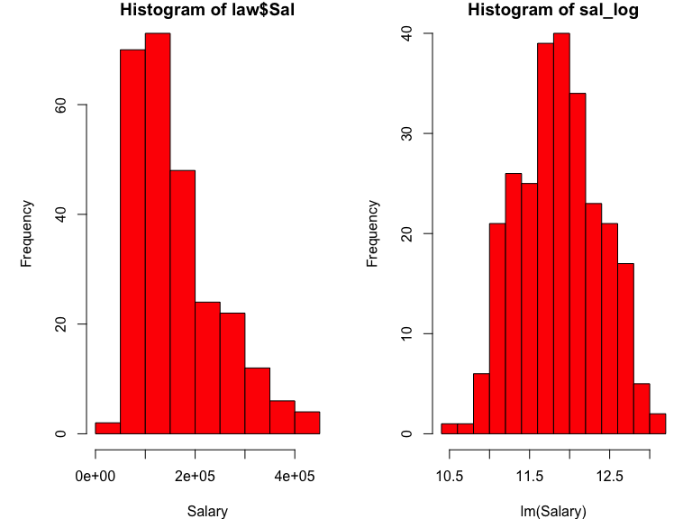

Final Project
================
Junhui Mi (jm4998)

``` r
law = read_csv("./data/Lawsuit.csv") %>%
  mutate(Sal = (Sal94 + Sal95)/2) %>%
  dplyr::select(-ID, -Sal94, -Sal95)
```

    ## Parsed with column specification:
    ## cols(
    ##   ID = col_double(),
    ##   Dept = col_double(),
    ##   Gender = col_double(),
    ##   Clin = col_double(),
    ##   Cert = col_double(),
    ##   Prate = col_double(),
    ##   Exper = col_double(),
    ##   Rank = col_double(),
    ##   Sal94 = col_double(),
    ##   Sal95 = col_double()
    ## )

``` r
law$Dept <- ifelse(law$Dept == 6, 0, ifelse(law$Dept != 6, law$Dept, NA))
law$Rank <- ifelse(law$Rank == 3, 0, ifelse(law$Rank != 3, law$Rank, NA))

law_1 = law %>%
  mutate(
    Gender = as.factor(Gender),
    Dept = as.factor(Dept),
    Clin = as.factor(Clin),
    Cert = as.factor(Cert),
    Rank = as.factor(Rank)
  )

law_df = law %>%
  mutate(Gender = factor(Gender, levels = c(0,1), labels = c("Female", "Male")),
         Dept = factor(Dept, levels = c(0,1,2,3,4,5), 
                       labels = c("Surgery", "Biochemistry/Molecular Biology", "Physiology", "Genetics", "Pediatrics", "Medicine")),
         Clin = factor(Clin, levels = c(0,1), labels = c("Primarily research emphasis", "Primarily clinical emphasis")),
         Cert = factor(Cert, levels = c(0,1), labels = c("not certified", "Board certified")),
         Rank = factor(Rank, levels = c(0,1,2), labels = c("Full professor", "Assistant", "Associate")))

my_labels <- list(Dept = "Department", Gender = "Gender", Clin = "Research/Clinical emphasis", Cert = "Not/Board Certificated", Prate = "Publication rate", Exper = "Experience(years)", Rank = "Title", Sal = "Average Salary in 1994-1995")

my_controls <- tableby.control(
  total = T,
  test = F, 
  digits = 2,
  numeric.stats = c("meansd", "medianq1q3", "range"),
  cat.stats = c("countpct"),
  stats.labels = list(
    meansd = "Mean (SD)",
    medianq1q3 = "Median (Q1, Q3)",
    range = "Min - Max",
    countpct = "N (%)"))

tab1 <- tableby(Gender ~ Dept + Clin + Cert + Prate + Exper + Rank + Sal, data = law_df, control = my_controls)

summary(tab1, title = "Summary by Gender", 
        labelTranslations = my_labels, text = T)
```

|                                   |         Female (N=106)          |           Male (N=155)           |          Total (N=261)          |
| :-------------------------------- | :-----------------------------: | :------------------------------: | :-----------------------------: |
| Department                        |                                 |                                  |                                 |
| \- Surgery                        |            5 (4.7%)             |            35 (22.6%)            |           40 (15.3%)            |
| \- Biochemistry/Molecular Biology |           20 (18.9%)            |            30 (19.4%)            |           50 (19.2%)            |
| \- Physiology                     |           20 (18.9%)            |            20 (12.9%)            |           40 (15.3%)            |
| \- Genetics                       |           11 (10.4%)            |            10 (6.5%)             |            21 (8.0%)            |
| \- Pediatrics                     |           20 (18.9%)            |            10 (6.5%)             |           30 (11.5%)            |
| \- Medicine                       |           30 (28.3%)            |            50 (32.3%)            |           80 (30.7%)            |
| Research/Clinical emphasis        |                                 |                                  |                                 |
| \- Primarily research emphasis    |           46 (43.4%)            |            55 (35.5%)            |           101 (38.7%)           |
| \- Primarily clinical emphasis    |           60 (56.6%)            |           100 (64.5%)            |           160 (61.3%)           |
| Not/Board Certificated            |                                 |                                  |                                 |
| \- not certified                  |           36 (34.0%)            |            37 (23.9%)            |           73 (28.0%)            |
| \- Board certified                |           70 (66.0%)            |           118 (76.1%)            |           188 (72.0%)           |
| Publication rate                  |                                 |                                  |                                 |
| \- Mean (SD)                      |           5.35 (1.89)           |           4.65 (1.94)            |           4.93 (1.94)           |
| \- Median (Q1, Q3)                |        5.25 (3.73, 7.27)        |        4.00 (3.10, 6.70)         |        4.40 (3.20, 6.90)        |
| \- Min - Max                      |           2.40 - 8.70           |           1.30 - 8.60            |           1.30 - 8.70           |
| Experience(years)                 |                                 |                                  |                                 |
| \- Mean (SD)                      |           7.49 (4.17)           |           12.10 (6.70)           |          10.23 (6.23)           |
| \- Median (Q1, Q3)                |       7.00 (5.00, 10.00)        |       10.00 (7.00, 15.00)        |       9.00 (6.00, 14.00)        |
| \- Min - Max                      |          1.00 - 23.00           |           2.00 - 37.00           |          1.00 - 37.00           |
| Title                             |                                 |                                  |                                 |
| \- Full professor                 |           16 (15.1%)            |            69 (44.5%)            |           85 (32.6%)            |
| \- Assistant                      |           69 (65.1%)            |            43 (27.7%)            |           112 (42.9%)           |
| \- Associate                      |           21 (19.8%)            |            43 (27.7%)            |           64 (24.5%)            |
| Average Salary in 1994-1995       |                                 |                                  |                                 |
| \- Mean (SD)                      |      124874.09 (59089.62)       |       186126.43 (90397.11)       |      161250.00 (84608.33)       |
| \- Median (Q1, Q3)                | 113706.00 (79059.88, 148401.12) | 162987.00 (114612.50, 244332.25) | 141628.00 (95176.50, 210012.50) |
| \- Min - Max                      |      36594.50 - 323872.50       |       55752.50 - 445859.00       |      36594.50 - 445859.00       |

Summary by Gender

``` r
attach(law)
pairs(law)
```


``` r
cor_mat = round(cor(law),2)


par(mar = c(4,5,1,1))
cor(law_df[ ,c(5,6,8)]) %>% 
  corrplot(method = "circle", type = "upper", diag = FALSE)
```


``` r
par(mfrow = c(1,3))
hist(law$Prate, xlab = "Publication rate", freq = T, col = 2)
hist(law$Exper, xlab = "Experience years", freq = T, col = 2)
hist(law$Sal, xlab = "Salary", freq = T, col = 2)
```



``` r
exper_log = log(law$Exper)
sal_log = log(law$Sal)

par(mfrow = c(1,3))
hist(law$Prate, xlab = "Publication rate", freq = T, col = 2)
hist(exper_log, xlab = "lm(Experience years)", freq = T, col = 2)
hist(sal_log, xlab = "lm(Salary)", freq = T, col = 2)
```


``` r
law_trans = law_df %>%
  mutate(
    exper_log = log(law$Exper),
    sal_log = log(law$Sal)
  ) %>% 
  dplyr::select(-Exper, -Sal)


mult_fit = lm(sal_log ~ Dept + Gender + Clin + Cert + Prate + Rank + exper_log, data = law_trans)
step(mult_fit, direction = 'backward')
```

Start: AIC=-1027.55 sal\_log \~ Dept + Gender + Clin + Cert + Prate +
Rank + exper\_log

``` 
        Df Sum of Sq     RSS      AIC
```

  - Gender 1 0.0147 4.6233 -1028.72
  - Prate 1 0.0341 4.6427 -1027.63 <none> 4.6086 -1027.55
  - Clin 1 0.3029 4.9115 -1012.94
  - Rank 2 1.0240 5.6326 -979.18
  - Cert 1 1.1817 5.7903 -969.97
  - exper\_log 1 1.5524 6.1610 -953.78
  - Dept 5 8.6840 13.2926 -761.08

Step: AIC=-1028.72 sal\_log \~ Dept + Clin + Cert + Prate + Rank +
exper\_log

``` 
        Df Sum of Sq     RSS      AIC
```

<none> 4.6233 -1028.72 - Prate 1 0.0494 4.6727 -1027.95 - Clin 1 0.2882
4.9115 -1014.94 - Rank 2 1.1018 5.7251 -976.93 - Cert 1 1.1882 5.8114
-971.03 - exper\_log 1 1.6604 6.2837 -950.63 - Dept 5 8.8220 13.4453
-760.10

Call: lm(formula = sal\_log \~ Dept + Clin + Cert + Prate + Rank +
exper\_log, data = law\_trans)

Coefficients: (Intercept) DeptBiochemistry/Molecular Biology  
12.06878 -0.85843  
DeptPhysiology DeptGenetics  
\-1.02545 -0.70945  
DeptPediatrics DeptMedicine  
\-0.70864 -0.36604  
ClinPrimarily clinical emphasis CertBoard certified  
0.16163 0.17600  
Prate RankAssistant  
\-0.02807 -0.21275  
RankAssociate exper\_log  
\-0.10469
0.18455

``` r
mult_fit = lm(sal_log ~ Dept + Clin + Cert + Prate + Rank + exper_log, data = law_trans)
summary(mult_fit)
```

Call: lm(formula = sal\_log \~ Dept + Clin + Cert + Prate + Rank +
exper\_log, data = law\_trans)

Residuals: Min 1Q Median 3Q Max -0.32090 -0.08351 -0.01059 0.07524
1.00546

Coefficients: Estimate Std. Error t value Pr(\>|t|) (Intercept) 12.06878
0.09438 127.876 \< 2e-16 DeptBiochemistry/Molecular Biology -0.85843
0.06265 -13.702 \< 2e-16 DeptPhysiology -1.02545 0.06239 -16.436 \<
2e-16 DeptGenetics -0.70945 0.05510 -12.876 \< 2e-16 DeptPediatrics
-0.70864 0.03624 -19.554 \< 2e-16 DeptMedicine -0.36604 0.03175 -11.528
\< 2e-16 ClinPrimarily clinical emphasis 0.16163 0.04102 3.940 0.000106
CertBoard certified 0.17600 0.02200 7.999 4.73e-14 Prate -0.02807
0.01721 -1.631 0.104163 RankAssistant -0.21275 0.02766 -7.690 3.40e-13
RankAssociate -0.10469 0.02374 -4.410 1.54e-05 exper\_log 0.18455
0.01952 9.457 \< 2e-16

(Intercept) *** DeptBiochemistry/Molecular Biology *** DeptPhysiology
*** DeptGenetics *** DeptPediatrics *** DeptMedicine *** ClinPrimarily
clinical emphasis *** CertBoard certified *** Prate  
RankAssistant *** RankAssociate *** exper\_log \*\*\* — Signif. codes: 0
‘***’ 0.001 ’**’ 0.01 ’*’ 0.05 ‘.’ 0.1 ’ ’ 1

Residual standard error: 0.1363 on 249 degrees of freedom Multiple
R-squared: 0.9313, Adjusted R-squared: 0.9283 F-statistic: 307 on 11 and
249 DF, p-value: \< 2.2e-16
