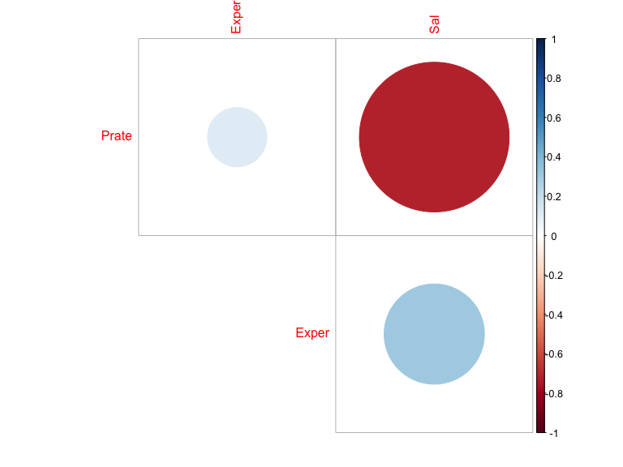

Final Project
================
Junhui Mi (jm4998)

``` r
law = read_csv("./data/Lawsuit.csv") %>%
  mutate(Sal = (Sal94 + Sal95)/2) %>%
  dplyr::select(-ID, -Sal94, -Sal95)
```

    ## Parsed with column specification:
    ## cols(
    ##   ID = col_double(),
    ##   Dept = col_double(),
    ##   Gender = col_double(),
    ##   Clin = col_double(),
    ##   Cert = col_double(),
    ##   Prate = col_double(),
    ##   Exper = col_double(),
    ##   Rank = col_double(),
    ##   Sal94 = col_double(),
    ##   Sal95 = col_double()
    ## )

``` r
law$Dept <- ifelse(law$Dept == 6, 0, ifelse(law$Dept != 6, law$Dept, NA))
law$Rank <- ifelse(law$Rank == 3, 0, ifelse(law$Rank != 3, law$Rank, NA))

law_1 = law %>%
  mutate(
    Gender = as.factor(Gender),
    Dept = as.factor(Dept),
    Clin = as.factor(Clin),
    Cert = as.factor(Cert),
    Rank = as.factor(Rank)
  )

law_df = law %>%
  mutate(Gender = factor(Gender, levels = c(0,1), labels = c("Female", "Male")),
         Dept = factor(Dept, levels = c(0,1,2,3,4,5), 
                       labels = c("Surgery", "Biochemistry/Molecular Biology", "Physiology", "Genetics", "Pediatrics", "Medicine")),
         Clin = factor(Clin, levels = c(0,1), labels = c("Primarily research emphasis", "Primarily clinical emphasis")),
         Cert = factor(Cert, levels = c(0,1), labels = c("not certified", "Board certified")),
         Rank = factor(Rank, levels = c(0,1,2), labels = c("Full professor", "Assistant", "Associate")))

my_labels <- list(Dept = "Department", Gender = "Gender", Clin = "Research/Clinical emphasis", Cert = "Not/Board Certificated", Prate = "Publication rate", Exper = "Experience(years)", Rank = "Title", Sal = "Average Salary in 1994-1995")

my_controls <- tableby.control(
  total = T,
  test = F, 
  digits = 2,
  numeric.stats = c("meansd", "medianq1q3", "range"),
  cat.stats = c("countpct"),
  stats.labels = list(
    meansd = "Mean (SD)",
    medianq1q3 = "Median (Q1, Q3)",
    range = "Min - Max",
    countpct = "N (%)"))

tab1 <- tableby(Gender ~ Dept + Clin + Cert + Prate + Exper + Rank + Sal, data = law_df, control = my_controls)

summary(tab1, title = "Summary by Gender", 
        labelTranslations = my_labels, text = T)
```

|                                   |         Female (N=106)          |           Male (N=155)           |          Total (N=261)          |
| :-------------------------------- | :-----------------------------: | :------------------------------: | :-----------------------------: |
| Department                        |                                 |                                  |                                 |
| \- Surgery                        |            5 (4.7%)             |            35 (22.6%)            |           40 (15.3%)            |
| \- Biochemistry/Molecular Biology |           20 (18.9%)            |            30 (19.4%)            |           50 (19.2%)            |
| \- Physiology                     |           20 (18.9%)            |            20 (12.9%)            |           40 (15.3%)            |
| \- Genetics                       |           11 (10.4%)            |            10 (6.5%)             |            21 (8.0%)            |
| \- Pediatrics                     |           20 (18.9%)            |            10 (6.5%)             |           30 (11.5%)            |
| \- Medicine                       |           30 (28.3%)            |            50 (32.3%)            |           80 (30.7%)            |
| Research/Clinical emphasis        |                                 |                                  |                                 |
| \- Primarily research emphasis    |           46 (43.4%)            |            55 (35.5%)            |           101 (38.7%)           |
| \- Primarily clinical emphasis    |           60 (56.6%)            |           100 (64.5%)            |           160 (61.3%)           |
| Not/Board Certificated            |                                 |                                  |                                 |
| \- not certified                  |           36 (34.0%)            |            37 (23.9%)            |           73 (28.0%)            |
| \- Board certified                |           70 (66.0%)            |           118 (76.1%)            |           188 (72.0%)           |
| Publication rate                  |                                 |                                  |                                 |
| \- Mean (SD)                      |           5.35 (1.89)           |           4.65 (1.94)            |           4.93 (1.94)           |
| \- Median (Q1, Q3)                |        5.25 (3.73, 7.27)        |        4.00 (3.10, 6.70)         |        4.40 (3.20, 6.90)        |
| \- Min - Max                      |           2.40 - 8.70           |           1.30 - 8.60            |           1.30 - 8.70           |
| Experience(years)                 |                                 |                                  |                                 |
| \- Mean (SD)                      |           7.49 (4.17)           |           12.10 (6.70)           |          10.23 (6.23)           |
| \- Median (Q1, Q3)                |       7.00 (5.00, 10.00)        |       10.00 (7.00, 15.00)        |       9.00 (6.00, 14.00)        |
| \- Min - Max                      |          1.00 - 23.00           |           2.00 - 37.00           |          1.00 - 37.00           |
| Title                             |                                 |                                  |                                 |
| \- Full professor                 |           16 (15.1%)            |            69 (44.5%)            |           85 (32.6%)            |
| \- Assistant                      |           69 (65.1%)            |            43 (27.7%)            |           112 (42.9%)           |
| \- Associate                      |           21 (19.8%)            |            43 (27.7%)            |           64 (24.5%)            |
| Average Salary in 1994-1995       |                                 |                                  |                                 |
| \- Mean (SD)                      |      124874.09 (59089.62)       |       186126.43 (90397.11)       |      161250.00 (84608.33)       |
| \- Median (Q1, Q3)                | 113706.00 (79059.88, 148401.12) | 162987.00 (114612.50, 244332.25) | 141628.00 (95176.50, 210012.50) |
| \- Min - Max                      |      36594.50 - 323872.50       |       55752.50 - 445859.00       |      36594.50 - 445859.00       |

Summary by Gender

``` r
attach(law)
pairs(law)
```


``` r
cor_mat = round(cor(law),2)


par(mar = c(4,5,1,1))
cor(law_df[ ,c(5,6,8)]) %>% 
  corrplot(method = "circle", type = "upper", diag = FALSE)
```



``` r
sal_log = log(law$Sal)

par(mfrow = c(1,2))

hist(law$Sal, xlab = "Salary", freq = T, col = 2)

hist(sal_log, xlab = "lm(Salary)", freq = T, col = 2)
```


``` r
law_trans = law_df %>%
  mutate(
    sal_log = log(law$Sal)
  ) %>% 
  dplyr::select(-Sal)


mult_fit = lm(sal_log ~ Dept + Gender + Clin + Cert + Prate + Rank + Exper, data = law_trans)
step(mult_fit, direction = 'backward')
```

    ## Start:  AIC=-1038.3
    ## sal_log ~ Dept + Gender + Clin + Cert + Prate + Rank + Exper
    ## 
    ##          Df Sum of Sq     RSS      AIC
    ## - Gender  1    0.0166  4.4393 -1039.32
    ## - Prate   1    0.0279  4.4506 -1038.66
    ## <none>                 4.4226 -1038.30
    ## - Clin    1    0.2858  4.7085 -1023.96
    ## - Rank    2    1.2646  5.6872  -976.66
    ## - Cert    1    1.4402  5.8628  -966.73
    ## - Exper   1    1.7384  6.1610  -953.78
    ## - Dept    5    9.1712 13.5938  -755.23
    ## 
    ## Step:  AIC=-1039.32
    ## sal_log ~ Dept + Clin + Cert + Prate + Rank + Exper
    ## 
    ##         Df Sum of Sq     RSS      AIC
    ## <none>                4.4393 -1039.32
    ## - Prate  1    0.0421  4.4814 -1038.86
    ## - Clin   1    0.2695  4.7088 -1025.94
    ## - Rank   2    1.3973  5.8366  -971.90
    ## - Cert   1    1.4549  5.8942  -967.33
    ## - Exper  1    1.8444  6.2837  -950.63
    ## - Dept   5    9.3583 13.7976  -753.35

    ## 
    ## Call:
    ## lm(formula = sal_log ~ Dept + Clin + Cert + Prate + Rank + Exper, 
    ##     data = law_trans)
    ## 
    ## Coefficients:
    ##                        (Intercept)  DeptBiochemistry/Molecular Biology  
    ##                           12.26603                            -0.86511  
    ##                     DeptPhysiology                        DeptGenetics  
    ##                           -1.04178                            -0.69957  
    ##                     DeptPediatrics                        DeptMedicine  
    ##                           -0.72362                            -0.37481  
    ##    ClinPrimarily clinical emphasis                 CertBoard certified  
    ##                            0.15640                             0.19168  
    ##                              Prate                       RankAssistant  
    ##                           -0.02586                            -0.22477  
    ##                      RankAssociate                               Exper  
    ##                           -0.08811                             0.01832

``` r
mult_fit = lm(sal_log ~ Dept + Clin + Cert + Prate + Rank + Exper, data = law_trans)
summary(mult_fit)
```

    ## 
    ## Call:
    ## lm(formula = sal_log ~ Dept + Clin + Cert + Prate + Rank + Exper, 
    ##     data = law_trans)
    ## 
    ## Residuals:
    ##      Min       1Q   Median       3Q      Max 
    ## -0.34228 -0.08136 -0.01292  0.08004  0.90901 
    ## 
    ## Coefficients:
    ##                                     Estimate Std. Error t value Pr(>|t|)
    ## (Intercept)                        12.266034   0.085607 143.283  < 2e-16
    ## DeptBiochemistry/Molecular Biology -0.865105   0.061350 -14.101  < 2e-16
    ## DeptPhysiology                     -1.041780   0.060909 -17.104  < 2e-16
    ## DeptGenetics                       -0.699570   0.054045 -12.944  < 2e-16
    ## DeptPediatrics                     -0.723620   0.035213 -20.549  < 2e-16
    ## DeptMedicine                       -0.374811   0.031005 -12.089  < 2e-16
    ## ClinPrimarily clinical emphasis     0.156395   0.040226   3.888 0.000130
    ## CertBoard certified                 0.191677   0.021218   9.034  < 2e-16
    ## Prate                              -0.025859   0.016831  -1.536 0.125711
    ## RankAssistant                      -0.224767   0.025719  -8.739 3.53e-16
    ## RankAssociate                      -0.088105   0.023618  -3.730 0.000237
    ## Exper                               0.018316   0.001801  10.171  < 2e-16
    ##                                       
    ## (Intercept)                        ***
    ## DeptBiochemistry/Molecular Biology ***
    ## DeptPhysiology                     ***
    ## DeptGenetics                       ***
    ## DeptPediatrics                     ***
    ## DeptMedicine                       ***
    ## ClinPrimarily clinical emphasis    ***
    ## CertBoard certified                ***
    ## Prate                                 
    ## RankAssistant                      ***
    ## RankAssociate                      ***
    ## Exper                              ***
    ## ---
    ## Signif. codes:  0 '***' 0.001 '**' 0.01 '*' 0.05 '.' 0.1 ' ' 1
    ## 
    ## Residual standard error: 0.1335 on 249 degrees of freedom
    ## Multiple R-squared:  0.9341, Adjusted R-squared:  0.9311 
    ## F-statistic: 320.6 on 11 and 249 DF,  p-value: < 2.2e-16

``` r
# divide the df for strata analysis

male_sal = law_trans %>% 
  janitor::clean_names() %>% 
  filter(gender == "Male")

male_model = lm(sal_log ~ dept + clin + cert + prate + rank + exper, data = male_sal)

summary(male_model)
```

    ## 
    ## Call:
    ## lm(formula = sal_log ~ dept + clin + cert + prate + rank + exper, 
    ##     data = male_sal)
    ## 
    ## Residuals:
    ##      Min       1Q   Median       3Q      Max 
    ## -0.32151 -0.07482 -0.01157  0.06715  0.83783 
    ## 
    ## Coefficients:
    ##                                     Estimate Std. Error t value Pr(>|t|)
    ## (Intercept)                        12.220889   0.112344 108.781  < 2e-16
    ## deptBiochemistry/Molecular Biology -0.950647   0.083389 -11.400  < 2e-16
    ## deptPhysiology                     -1.083744   0.083288 -13.012  < 2e-16
    ## deptGenetics                       -0.714681   0.067048 -10.659  < 2e-16
    ## deptPediatrics                     -0.728167   0.051824 -14.051  < 2e-16
    ## deptMedicine                       -0.395141   0.037962 -10.409  < 2e-16
    ## clinPrimarily clinical emphasis     0.154465   0.054752   2.821  0.00547
    ## certBoard certified                 0.191041   0.029649   6.443 1.67e-09
    ## prate                              -0.006269   0.023462  -0.267  0.78970
    ## rankAssistant                      -0.184924   0.034809  -5.313 4.05e-07
    ## rankAssociate                      -0.092275   0.028798  -3.204  0.00167
    ## exper                               0.016767   0.002061   8.135 1.81e-13
    ##                                       
    ## (Intercept)                        ***
    ## deptBiochemistry/Molecular Biology ***
    ## deptPhysiology                     ***
    ## deptGenetics                       ***
    ## deptPediatrics                     ***
    ## deptMedicine                       ***
    ## clinPrimarily clinical emphasis    ** 
    ## certBoard certified                ***
    ## prate                                 
    ## rankAssistant                      ***
    ## rankAssociate                      ** 
    ## exper                              ***
    ## ---
    ## Signif. codes:  0 '***' 0.001 '**' 0.01 '*' 0.05 '.' 0.1 ' ' 1
    ## 
    ## Residual standard error: 0.1354 on 143 degrees of freedom
    ## Multiple R-squared:  0.9283, Adjusted R-squared:  0.9228 
    ## F-statistic: 168.3 on 11 and 143 DF,  p-value: < 2.2e-16

``` r
female_sal = law_trans %>% 
  janitor::clean_names() %>% 
  filter(gender == "Female")

female_model = lm(sal_log ~ dept + clin + cert + prate + rank + exper, data = female_sal)

summary(female_model)
```

    ## 
    ## Call:
    ## lm(formula = sal_log ~ dept + clin + cert + prate + rank + exper, 
    ##     data = female_sal)
    ## 
    ## Residuals:
    ##      Min       1Q   Median       3Q      Max 
    ## -0.29807 -0.07145 -0.00848  0.08811  0.27274 
    ## 
    ## Coefficients:
    ##                                     Estimate Std. Error t value Pr(>|t|)
    ## (Intercept)                        12.205642   0.153074  79.737  < 2e-16
    ## deptBiochemistry/Molecular Biology -0.820013   0.104463  -7.850 6.59e-12
    ## deptPhysiology                     -1.020745   0.101369 -10.070  < 2e-16
    ## deptGenetics                       -0.688873   0.098614  -6.986 4.02e-10
    ## deptPediatrics                     -0.698901   0.065868 -10.611  < 2e-16
    ## deptMedicine                       -0.353627   0.066394  -5.326 6.83e-07
    ## clinPrimarily clinical emphasis     0.163444   0.062829   2.601   0.0108
    ## certBoard certified                 0.173386   0.033360   5.197 1.17e-06
    ## prate                              -0.035500   0.025960  -1.367   0.1747
    ## rankAssistant                      -0.205505   0.050098  -4.102 8.71e-05
    ## rankAssociate                      -0.066601   0.046699  -1.426   0.1571
    ## exper                               0.027792   0.004495   6.183 1.61e-08
    ##                                       
    ## (Intercept)                        ***
    ## deptBiochemistry/Molecular Biology ***
    ## deptPhysiology                     ***
    ## deptGenetics                       ***
    ## deptPediatrics                     ***
    ## deptMedicine                       ***
    ## clinPrimarily clinical emphasis    *  
    ## certBoard certified                ***
    ## prate                                 
    ## rankAssistant                      ***
    ## rankAssociate                         
    ## exper                              ***
    ## ---
    ## Signif. codes:  0 '***' 0.001 '**' 0.01 '*' 0.05 '.' 0.1 ' ' 1
    ## 
    ## Residual standard error: 0.127 on 94 degrees of freedom
    ## Multiple R-squared:  0.9292, Adjusted R-squared:  0.9209 
    ## F-statistic: 112.1 on 11 and 94 DF,  p-value: < 2.2e-16

``` r
a = law_trans %>% 
  janitor::clean_names() %>% 
  group_by(gender) %>% 
  summarise(mean_sal_log = mean(sal_log), 
            sd_sal_log = sd(sal_log))

ggplot(data = a, aes(x = gender, y = mean_sal_log, fill = gender)) + 
  geom_bar(stat = "identity", width = .5, position = "dodge") + 
  geom_errorbar(aes(ymin = mean_sal_log - sd_sal_log, ymax = mean_sal_log + sd_sal_log), position = position_dodge(width = 0.5), width = .3)
```


``` r
# direct way
# law_trans %>% group_by(Gender) %>% summarise(mean_sal = mean(sal_log))
# law %>% group_by(Gender) %>% summarise(mean_sal = mean(Sal))
```
